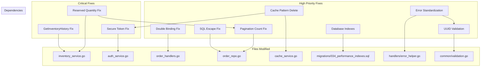

# Codebase Fixes Implementation Plan

**Status**: DRAFT  
**Created**: 2025-11-25  
**Last Updated**: 2025-11-25  
**Scope**: Critical and High Severity Issues Only

---

## 1. Requirements

### 🔴 CRITICAL Issues (Must Fix)

| # | Requirement | Location | Impact |
|---|-------------|----------|--------|
| REQ-C1 | Implement GetInventoryHistory to return actual audit log data | `internal/services/inventory_service.go:92-95` | API returns empty data silently |
| REQ-C2 | Fix reserved quantity persistence in updateReservedQuantity | `internal/services/inventory_service.go:439-462` | Reservations never saved, causes overselling |
| REQ-C3 | Remove weak fallback token generation | `internal/services/auth_service.go:676-681` | Password reset tokens could be guessed |

### 🟠 HIGH Severity Issues (Should Fix)

| # | Requirement | Location | Impact |
|---|-------------|----------|--------|
| REQ-H1 | Fix double request body binding in order handler | `internal/handlers/order_handlers.go:58-68` | Complex order creation fails |
| REQ-H2 | Escape SQL LIKE special characters in search | `internal/repositories/order_repo.go:142-162` | SQL pattern manipulation possible |
| REQ-H3 | Add total count to pagination methods | `internal/repositories/order_repo.go:230-310` | Proper pagination UI impossible |
| REQ-H4 | Implement DeleteByPattern for token revocation | `internal/caching/cache_service.go` + `internal/services/auth_service.go:446-509` | Tokens may not revoke on logout |
| REQ-H5 | Add missing database indexes | Database migrations | Query performance degradation at scale |
| REQ-H6 | Standardize error handling patterns | Multiple handlers | Inconsistent API responses |
| REQ-H7 | Add UUID parameter validation | Multiple handlers | 500 errors instead of 400 Bad Request |

---

## 2. Assumptions

| # | Assumption | Status |
|---|------------|--------|
| A1 | The `audit_logs` table and `AuditLogsRepository` are the correct source for inventory history | CONFIRMED via code inspection |
| A2 | The inventory table has a `reserved_quantity` column | PENDING - needs schema verification |
| A3 | Redis `KEYS` command is acceptable for pattern deletion in production | PENDING - may need SCAN for large datasets |
| A4 | Existing tests can be extended rather than rewritten | CONFIRMED |
| A5 | The CacheService interface can be extended with new methods | CONFIRMED |

---

## 3. Technical Decisions

### Decision 1: GetInventoryHistory Implementation
- **What**: Use `AuditLogsRepository.GetByTableAndRecord()` to fetch inventory change history
- **Rationale**: The repository already has this method that filters by table_name and record_id
- **Alternatives Considered**: 
  - Create separate inventory_history table (rejected - adds complexity)
  - Use stock_adjustments table (rejected - audit logs provide more context)
- **Trade-offs**: Depends on audit logs being properly written for inventory changes

### Decision 2: Reserved Quantity Persistence
- **What**: Create new repository method `UpdateReservedQuantity()` that specifically updates the reserved_quantity column
- **Rationale**: Current `Update()` method updates the full inventory record; we need a targeted update
- **Alternatives Considered**:
  - Modify existing `Update()` to handle reserved_quantity (rejected - changes existing behavior)
  - Use raw SQL in service layer (rejected - breaks repository pattern)
- **Trade-offs**: Adds new method to repository interface

### Decision 3: Secure Token Generation
- **What**: Return error immediately if `crypto/rand` fails instead of falling back to time-based generation
- **Rationale**: Time-based tokens are predictable and insecure; better to fail than be insecure
- **Alternatives Considered**:
  - Use multiple entropy sources (rejected - adds complexity, still not as secure as crypto/rand)
  - Retry crypto/rand multiple times (acceptable as enhancement)
- **Trade-offs**: Password reset will fail if system has no entropy, but this is extremely rare

### Decision 4: Request Body Binding Fix
- **What**: Parse body once into `map[string]interface{}`, then check for "orders" key to determine if bulk
- **Rationale**: Cannot bind body twice as it's consumed on first read
- **Alternatives Considered**:
  - Use separate endpoints for single vs bulk (rejected - changes API contract)
  - Read raw body and manually unmarshal (equivalent complexity)
- **Trade-offs**: Slightly more complex type checking in handler

### Decision 5: SQL LIKE Escape
- **What**: Create utility function `escapeLikePattern()` that escapes `%`, `_`, and `\` characters
- **Rationale**: Standard SQL injection prevention for LIKE patterns
- **Alternatives Considered**:
  - Use parameterized full-text search (overkill for simple search)
- **Trade-offs**: May affect legitimate searches containing these characters

### Decision 6: Pagination Total Count
- **What**: Return a struct containing both `items` and `total_count` from List/Search methods
- **Rationale**: UI needs total count for pagination controls
- **Alternatives Considered**:
  - Separate endpoint for count (rejected - doubles database queries)
  - Use cursor-based pagination (larger change, future consideration)
- **Trade-offs**: Adds COUNT query to each paginated request

### Decision 7: Cache Pattern Deletion
- **What**: Add `DeleteByPattern()` method to CacheService interface using Redis SCAN + DEL
- **Rationale**: `KEYS` command is blocking; SCAN is non-blocking and production-safe
- **Alternatives Considered**:
  - Use KEYS for simplicity (rejected - blocks Redis)
  - Store token list per user (rejected - adds complexity)
- **Trade-offs**: Multiple round-trips to Redis for large key sets

### Decision 8: Database Indexes
- **What**: Create migration with indexes on: `orders(status)`, `orders(order_date)`, `inventory(product_id, warehouse_id)`
- **Rationale**: These columns are frequently used in WHERE clauses and JOINs
- **Alternatives Considered**:
  - Partial indexes (could be added later for specific status values)
- **Trade-offs**: Slight write performance impact, storage overhead

### Decision 9: Error Handling Standardization
- **What**: Create error response helper functions: `BadRequest()`, `NotFound()`, `InternalError()`, etc.
- **Rationale**: Ensures consistent JSON structure across all endpoints
- **Alternatives Considered**:
  - Use middleware (would require significant refactoring)
- **Trade-offs**: Requires updating all handlers

### Decision 10: UUID Validation
- **What**: Add validation middleware/helper that parses UUIDs and returns 400 if invalid
- **Rationale**: Prevents database errors from bubbling up as 500s
- **Alternatives Considered**:
  - Validate in each handler (repetitive)
  - Use regex in routes (Echo doesn't support this cleanly)
- **Trade-offs**: Small overhead per request

---

## 4. Architecture Overview



---

## 5. Implementation Tasks

### Task 1: Fix GetInventoryHistory - Return Actual Audit Log Data
- **Status**: NOT_STARTED
- **Severity**: 🔴 CRITICAL
- **Files to Modify**: 
  - `internal/services/inventory_service.go`
- **Dependencies**: None
- **Estimated Complexity**: LOW
- **Description**: 
  The function at lines 92-95 returns empty `[]*models.AuditLog{}`. Implement actual query using `AuditLogsRepository.GetByTableAndRecord()` with table_name="inventory" and the inventory record ID.
- **Changes**:
  1. Inject `AuditLogsRepository` into `InventoryService` if not already present
  2. In `GetInventoryHistory()`, call `auditLogsRepo.GetByTableAndRecord(ctx, tenantID, "inventory", inventoryID.String(), limit, offset)`
  3. Return the result or handle error appropriately
- **Acceptance Criteria**:
  - [ ] Function returns actual audit log entries for inventory changes
  - [ ] Empty result returned only when no history exists
  - [ ] Proper error handling for repository failures
- **Tests to Write**:
  - `TestGetInventoryHistory_ReturnsActualData`
  - `TestGetInventoryHistory_EmptyWhenNoHistory`
  - `TestGetInventoryHistory_RespectsLimitOffset`

---

### Task 2: Add UpdateReservedQuantity Repository Method
- **Status**: NOT_STARTED
- **Severity**: 🔴 CRITICAL
- **Files to Modify**: 
  - `internal/repositories/inventory_repo.go`
  - `internal/repositories/inventory_adapter.go`
- **Dependencies**: None
- **Estimated Complexity**: MEDIUM
- **Description**: 
  Create a new repository method that updates only the `reserved_quantity` column. This is needed because `UpdateStock()` only updates `quantity`.
- **Changes**:
  1. Add interface method: `UpdateReservedQuantity(ctx, tenantID, productID, warehouseID uuid.UUID, reservedQty int) error`
  2. Implement SQL: `UPDATE inventory SET reserved_quantity = $4, updated_at = NOW() WHERE tenant_id = $1 AND product_id = $2 AND warehouse_id = $3`
  3. Add method to `InventoryAdapter` that delegates to the repository
- **Acceptance Criteria**:
  - [ ] New method exists on `InventoryRepository` interface
  - [ ] Method updates only reserved_quantity column
  - [ ] Method returns error if no rows affected
- **Tests to Write**:
  - `TestUpdateReservedQuantity_Success`
  - `TestUpdateReservedQuantity_NotFound`
  - `TestUpdateReservedQuantity_TenantIsolation`

---

### Task 3: Fix updateReservedQuantity Service Method
- **Status**: NOT_STARTED
- **Severity**: 🔴 CRITICAL
- **Files to Modify**: 
  - `internal/services/inventory_service.go`
- **Dependencies**: Task 2
- **Estimated Complexity**: LOW
- **Description**: 
  At lines 439-462, `updateReservedQuantity` calculates the new reserved quantity but calls `UpdateStock()` which only updates `Quantity`. Change to use the new `UpdateReservedQuantity()` method.
- **Changes**:
  1. Replace call to `UpdateStock()` with `UpdateReservedQuantity()`
  2. Pass the calculated `newReserved` value to the new method
  3. Ensure tenant isolation is maintained
- **Acceptance Criteria**:
  - [ ] Reserved quantity is actually persisted to database
  - [ ] Existing tests still pass
  - [ ] Inventory reservations work correctly end-to-end
- **Tests to Write**:
  - `TestUpdateReservedQuantity_PersistsToDatabase`
  - `TestReservationFlow_EndToEnd`

---

### Task 4: Remove Weak Token Fallback
- **Status**: NOT_STARTED
- **Severity**: 🔴 CRITICAL
- **Files to Modify**: 
  - `internal/services/auth_service.go`
- **Dependencies**: None
- **Estimated Complexity**: LOW
- **Description**: 
  At lines 676-681, the code falls back to time-based token generation when `crypto/rand` fails. This is insecure. Change to return an error instead.
- **Changes**:
  1. Remove the fallback code block that uses `time.Now().UnixNano()`
  2. Return error immediately if `crypto/rand.Read()` fails
  3. Update any callers to handle this error appropriately
- **Acceptance Criteria**:
  - [ ] No fallback to time-based tokens
  - [ ] Error returned if crypto/rand fails
  - [ ] Callers handle the error gracefully
- **Tests to Write**:
  - `TestGenerateToken_FailsWithoutCryptoRand` (may need mock)
  - `TestGenerateToken_NoTimeBased`

---

### Task 5: Fix Double Request Body Binding
- **Status**: NOT_STARTED
- **Severity**: 🟠 HIGH
- **Files to Modify**: 
  - `internal/handlers/order_handlers.go`
- **Dependencies**: None
- **Estimated Complexity**: MEDIUM
- **Description**: 
  At lines 58-68, the handler binds the body twice. The second bind fails because the body is already consumed. Parse once and detect bulk vs single from the parsed data.
- **Changes**:
  1. Read raw body using `io.ReadAll(c.Request().Body)`
  2. Try to unmarshal into `map[string]interface{}`
  3. Check if "orders" key exists to determine bulk vs single
  4. Unmarshal again into appropriate struct type
- **Acceptance Criteria**:
  - [ ] Single order creation works
  - [ ] Bulk order creation works
  - [ ] Proper error response for invalid JSON
- **Tests to Write**:
  - `TestCreateOrder_SingleOrder`
  - `TestCreateOrder_BulkOrders`
  - `TestCreateOrder_InvalidJSON`

---

### Task 6: Add SQL LIKE Pattern Escape Utility
- **Status**: NOT_STARTED
- **Severity**: 🟠 HIGH
- **Files to Modify**: 
  - `internal/common/safety_utils.go` (or create new file)
- **Dependencies**: None
- **Estimated Complexity**: LOW
- **Description**: 
  Create a utility function that escapes SQL LIKE special characters `%`, `_`, and `\`.
- **Changes**:
  1. Create function `EscapeLikePattern(input string) string`
  2. Replace `\` with `\\`, `%` with `\%`, `_` with `\_`
  3. Document the escape character being used
- **Acceptance Criteria**:
  - [ ] Function escapes all LIKE special characters
  - [ ] Escape character is consistent
  - [ ] Function is exported for use across packages
- **Tests to Write**:
  - `TestEscapeLikePattern_Percent`
  - `TestEscapeLikePattern_Underscore`
  - `TestEscapeLikePattern_Backslash`
  - `TestEscapeLikePattern_Combined`

---

### Task 7: Apply SQL Escape in Order Repository Search
- **Status**: NOT_STARTED
- **Severity**: 🟠 HIGH
- **Files to Modify**: 
  - `internal/repositories/order_repo.go`
- **Dependencies**: Task 6
- **Estimated Complexity**: LOW
- **Description**: 
  At lines 142-162, `filter.Query` is used directly in ILIKE. Apply the escape function.
- **Changes**:
  1. Import the safety utils package
  2. Before using `filter.Query` in ILIKE, call `EscapeLikePattern(filter.Query)`
  3. Add `ESCAPE '\'` clause to the LIKE query if not present
- **Acceptance Criteria**:
  - [ ] Special characters in search don't affect query behavior
  - [ ] Search still works for normal queries
  - [ ] No SQL injection via LIKE patterns
- **Tests to Write**:
  - `TestSearchOrders_WithSpecialCharacters`
  - `TestSearchOrders_NormalQueryStillWorks`

---

### Task 8: Add Pagination Total Count to Order Repository
- **Status**: NOT_STARTED
- **Severity**: 🟠 HIGH
- **Files to Modify**: 
  - `internal/repositories/order_repo.go`
  - `internal/models/pagination.go` (create if needed)
- **Dependencies**: None
- **Estimated Complexity**: MEDIUM
- **Description**: 
  The `List` and `AdvancedSearch` methods don't return total count. Add a count query.
- **Changes**:
  1. Create `PaginatedResult[T]` struct with `Items []T`, `Total int64`, `Page int`, `PageSize int`
  2. Modify `List` to execute COUNT query without LIMIT/OFFSET
  3. Modify `AdvancedSearch` similarly
  4. Update method signatures and callers
- **Acceptance Criteria**:
  - [ ] Total count is accurate
  - [ ] Count respects same filters as main query
  - [ ] Existing callers updated to use new return type
- **Tests to Write**:
  - `TestListOrders_ReturnsTotalCount`
  - `TestAdvancedSearch_ReturnsTotalCount`
  - `TestPaginatedResult_CorrectPageInfo`

---

### Task 9: Add DeleteByPattern to Cache Service
- **Status**: NOT_STARTED
- **Severity**: 🟠 HIGH
- **Files to Modify**: 
  - `internal/caching/cache_service.go`
- **Dependencies**: None
- **Estimated Complexity**: MEDIUM
- **Description**: 
  Add a method to delete keys matching a pattern. Use SCAN instead of KEYS for production safety.
- **Changes**:
  1. Add interface method: `DeleteByPattern(ctx context.Context, pattern string) error`
  2. Implement using Redis SCAN command with cursor
  3. Delete keys in batches using DEL command
  4. Handle errors appropriately
- **Acceptance Criteria**:
  - [ ] Pattern matching works correctly
  - [ ] Non-blocking (uses SCAN, not KEYS)
  - [ ] Handles empty result gracefully
- **Tests to Write**:
  - `TestDeleteByPattern_DeletesMatchingKeys`
  - `TestDeleteByPattern_NoMatchingKeys`
  - `TestDeleteByPattern_LargeKeySet`

---

### Task 10: Update Token Revocation to Use DeleteByPattern
- **Status**: NOT_STARTED
- **Severity**: 🟠 HIGH
- **Files to Modify**: 
  - `internal/services/auth_service.go`
- **Dependencies**: Task 9
- **Estimated Complexity**: LOW
- **Description**: 
  At lines 446-509, `RevokeUserTokens` may call a non-existent `DeletePattern` method. Update to use the new `DeleteByPattern`.
- **Changes**:
  1. Change method call from `DeletePattern` to `DeleteByPattern`
  2. Verify pattern format is correct for the cache key structure
  3. Handle errors from the new method
- **Acceptance Criteria**:
  - [ ] User tokens are actually revoked on logout
  - [ ] All tokens for user are deleted
  - [ ] Error handling is proper
- **Tests to Write**:
  - `TestRevokeUserTokens_DeletesAllTokens`
  - `TestLogout_RevokesTokens`

---

### Task 11: Add Database Performance Indexes
- **Status**: NOT_STARTED
- **Severity**: 🟠 HIGH
- **Files to Create**: 
  - `migrations/034_add_performance_indexes.sql`
- **Dependencies**: None
- **Estimated Complexity**: LOW
- **Description**: 
  Create missing indexes for frequently queried columns.
- **Changes**:
  Create migration file with:
  ```sql
  -- Index for order status filtering
  CREATE INDEX IF NOT EXISTS idx_orders_status ON orders(status);
  
  -- Index for order date range queries
  CREATE INDEX IF NOT EXISTS idx_orders_order_date ON orders(order_date);
  
  -- Composite index for inventory lookups
  CREATE INDEX IF NOT EXISTS idx_inventory_product_warehouse ON inventory(product_id, warehouse_id);
  
  -- Index for tenant-scoped order queries
  CREATE INDEX IF NOT EXISTS idx_orders_tenant_status ON orders(tenant_id, status);
  ```
- **Acceptance Criteria**:
  - [ ] Migration runs without error
  - [ ] Indexes are created
  - [ ] Migration is idempotent (IF NOT EXISTS)
- **Tests to Write**:
  - Manual verification via database inspection

---

### Task 12: Create Error Response Helper Functions
- **Status**: NOT_STARTED
- **Severity**: 🟠 HIGH
- **Files to Create**: 
  - `internal/handlers/error_responses.go`
- **Dependencies**: None
- **Estimated Complexity**: LOW
- **Description**: 
  Create standardized error response helper functions.
- **Changes**:
  1. Create `ErrorResponse` struct: `{Error string, Code string, Details map[string]interface{}}`
  2. Create helper functions:
     - `BadRequest(c echo.Context, message string, details ...map[string]interface{}) error`
     - `NotFound(c echo.Context, resource string) error`
     - `InternalError(c echo.Context, err error) error`
     - `Unauthorized(c echo.Context, message string) error`
     - `Forbidden(c echo.Context, message string) error`
  3. Each returns JSON with consistent structure
- **Acceptance Criteria**:
  - [ ] Consistent JSON structure across all error types
  - [ ] HTTP status codes are correct
  - [ ] Internal errors don't leak stack traces
- **Tests to Write**:
  - `TestBadRequest_ReturnsCorrectStatus`
  - `TestNotFound_ReturnsCorrectBody`
  - `TestInternalError_HidesDetails`

---

### Task 13: Create UUID Validation Helper
- **Status**: NOT_STARTED
- **Severity**: 🟠 HIGH
- **Files to Modify**: 
  - `internal/common/validation.go`
- **Dependencies**: Task 12
- **Estimated Complexity**: LOW
- **Description**: 
  Create a helper function to parse and validate UUID parameters.
- **Changes**:
  1. Create function `ParseUUID(value string) (uuid.UUID, error)`
  2. Create Echo middleware or helper `RequireUUID(c echo.Context, param string) (uuid.UUID, error)`
  3. Return appropriate 400 error if invalid
- **Acceptance Criteria**:
  - [ ] Valid UUIDs are parsed correctly
  - [ ] Invalid UUIDs return 400 Bad Request
  - [ ] Empty UUIDs return 400 Bad Request
- **Tests to Write**:
  - `TestParseUUID_ValidUUID`
  - `TestParseUUID_InvalidUUID`
  - `TestParseUUID_EmptyString`

---

### Task 14: Apply UUID Validation to Key Handlers
- **Status**: NOT_STARTED
- **Severity**: 🟠 HIGH
- **Files to Modify**: 
  - `internal/handlers/order_handlers.go`
  - `internal/handlers/inventory_handlers.go`
  - `internal/handlers/product_handlers.go`
- **Dependencies**: Task 13
- **Estimated Complexity**: MEDIUM
- **Description**: 
  Apply UUID validation to handlers that accept UUID path parameters.
- **Changes**:
  1. Replace `uuid.Parse(c.Param("id"))` with the new validation helper
  2. Return proper 400 error instead of letting it propagate as 500
  3. Apply to GetByID, Update, Delete handlers for orders, inventory, products
- **Acceptance Criteria**:
  - [ ] Invalid UUIDs return 400 Bad Request
  - [ ] Error message is user-friendly
  - [ ] Valid UUIDs continue to work
- **Tests to Write**:
  - `TestGetOrder_InvalidUUID_Returns400`
  - `TestUpdateProduct_InvalidUUID_Returns400`

---

## 6. Edge Cases and Error Handling

### Edge Case 1: Empty Audit Logs for Inventory
- **Scenario**: GetInventoryHistory called for inventory with no changes recorded
- **Handling**: Return empty array (not null), HTTP 200
- **Task**: Task 1

### Edge Case 2: Concurrent Reserved Quantity Updates
- **Scenario**: Two requests try to update reserved quantity simultaneously
- **Handling**: Use optimistic locking or atomic UPDATE with WHERE clause checking current value
- **Task**: Task 2, 3

### Edge Case 3: crypto/rand Failure
- **Scenario**: System has no entropy available
- **Handling**: Return error to caller, who should return 503 Service Unavailable
- **Task**: Task 4

### Edge Case 4: Search Query with Only Special Characters
- **Scenario**: User searches for just "%"
- **Handling**: Escape and search normally - will match nothing or everything based on position
- **Task**: Task 7

### Edge Case 5: Pattern Matches Thousands of Keys
- **Scenario**: DeleteByPattern matches many keys
- **Handling**: Delete in batches, consider timeout/limit
- **Task**: Task 9

### Edge Case 6: Migration on Large Table
- **Scenario**: Creating index on table with millions of rows
- **Handling**: Use CONCURRENTLY option if available, run during low-traffic period
- **Task**: Task 11

---

## 7. Testing Strategy

### Unit Tests
- Each task includes specific test cases
- Mock database and Redis for isolation
- Test error paths explicitly

### Integration Tests
- Test inventory history retrieval with real database
- Test reservation flow end-to-end
- Test order creation (single and bulk)
- Test search with various inputs
- Test token revocation flow

### Manual Verification
1. **Inventory History**: Create inventory, make changes, verify history endpoint returns changes
2. **Reservations**: Reserve inventory, verify database shows correct reserved_quantity
3. **Token Security**: Verify no time-based tokens in logs/responses
4. **Order Creation**: Test Postman/curl with single and bulk order payloads
5. **Search**: Test search with `%`, `_`, `\` characters
6. **Pagination**: Verify total count in responses
7. **Token Revocation**: Login, logout, verify old token rejected
8. **Query Performance**: Run EXPLAIN on queries with new indexes

---

## 8. Rollback Plan

### Database Changes (Task 11)
```sql
DROP INDEX IF EXISTS idx_orders_status;
DROP INDEX IF EXISTS idx_orders_order_date;
DROP INDEX IF EXISTS idx_inventory_product_warehouse;
DROP INDEX IF EXISTS idx_orders_tenant_status;
```

### Code Changes
- All code changes are in version control
- Revert commits in reverse order if needed
- Feature flags not used (changes are bug fixes, not features)

### Specific Rollbacks
1. **Tasks 1-4 (Critical)**: Revert commits, deploy previous version
2. **Tasks 5-7**: Revert order handler/repo changes
3. **Tasks 8-10**: Revert pagination and cache changes
4. **Tasks 12-14**: Revert error handling changes, handlers will return to old behavior

---

## 9. Deviations Log

*[To be populated during implementation if any deviations from this plan are necessary]*

---

## 10. Completion Checklist

### Critical Issues
- [ ] REQ-C1: GetInventoryHistory returns actual data
- [ ] REQ-C2: Reserved quantity persists to database
- [ ] REQ-C3: No weak token fallback exists

### High Priority Issues
- [ ] REQ-H1: Order creation handles single and bulk correctly
- [ ] REQ-H2: Search escapes LIKE special characters
- [ ] REQ-H3: Pagination includes total count
- [ ] REQ-H4: Token revocation actually works
- [ ] REQ-H5: Performance indexes exist
- [ ] REQ-H6: Error responses are standardized
- [ ] REQ-H7: UUID validation returns 400 for invalid input

### Quality Gates
- [ ] All new tests pass
- [ ] Existing tests still pass
- [ ] No regressions in API behavior
- [ ] Code review completed
- [ ] Documentation updated

---

## 11. Implementation Order Summary

```
Phase 1: Critical Security & Data Integrity
├── Task 4: Remove weak token fallback (independent)
├── Task 2: Add UpdateReservedQuantity repository method
└── Task 3: Fix updateReservedQuantity service method (depends on Task 2)

Phase 2: Critical Functionality
├── Task 1: Fix GetInventoryHistory
├── Task 9: Add DeleteByPattern to cache
└── Task 10: Update token revocation (depends on Task 9)

Phase 3: High Priority Fixes
├── Task 5: Fix double request body binding
├── Task 6: Add SQL escape utility
├── Task 7: Apply SQL escape in search (depends on Task 6)
├── Task 8: Add pagination total count
└── Task 11: Add database indexes

Phase 4: Error Handling Improvements
├── Task 12: Create error response helpers
├── Task 13: Create UUID validation helper (depends on Task 12)
└── Task 14: Apply UUID validation to handlers (depends on Task 13)
```

---

## 12. Estimated Effort

| Phase | Tasks | Complexity | Estimated Time |
|-------|-------|------------|----------------|
| Phase 1 | 3 tasks | Medium | 2-3 hours |
| Phase 2 | 3 tasks | Low-Medium | 2-3 hours |
| Phase 3 | 5 tasks | Low-Medium | 3-4 hours |
| Phase 4 | 3 tasks | Low-Medium | 2-3 hours |
| **Total** | **14 tasks** | | **9-13 hours** |

*Note: Includes writing tests but not integration testing time*