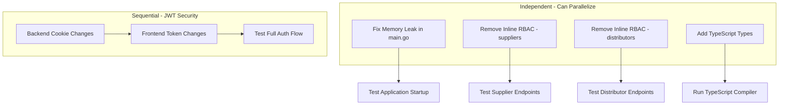

# Security and Code Quality Improvements Analysis

**Status**: ANALYSIS COMPLETE  
**Created**: 2025-11-25  
**Last Updated**: 2025-11-25  
**Purpose**: Analysis document to inform implementation planning

---

## 1. Current Implementation Patterns Found

### 1.1 JWT/Auth Security

**Current Token Storage Pattern** (Frontend):
- **File**: [`frontend/lib/security.ts`](frontend/lib/security.ts:36-43)
- Tokens are stored in `localStorage`
- Access token and refresh token both in browser storage
- Pattern used:
```typescript
setTokens(accessToken?: string, refreshToken?: string) {
  if (accessToken) {
    this.accessToken = accessToken;
    localStorage.setItem('access_token', accessToken);
  }
}
```

**Backend Auth Flow**:
- **File**: [`internal/handlers/auth_handlers.go`](internal/handlers/auth_handlers.go)
- Uses JWT with configurable expiration (1 hour access, 24 hour refresh)
- JWT secret loaded from environment variable
- Development mode allows random secret generation (security risk in production)

**Frontend Auth Hook**:
- **File**: [`frontend/hooks/useAuth.ts`](frontend/hooks/useAuth.ts)
- Uses React Query for auth state management
- Integrates with security token manager

### 1.2 RBAC Implementation

**Middleware RBAC** (Well-structured):
- **File**: [`internal/middleware/rbac.go`](internal/middleware/rbac.go)
- Supports AND/OR permission logic via `RequirePermission()` and `RequireAllPermissions()`
- Clean middleware pattern that should be applied at route level

**Route-Level RBAC Application** (Correct Pattern):
- **File**: [`cmd/main.go`](cmd/main.go:652-731)
- Routes correctly apply RBAC at route registration level:
```go
protected.GET("/users", userHandlers.ListUsers, rbacMiddleware.RequirePermission("user.list"))
```

**Inline RBAC Pattern** (Anti-pattern Found):
- **File**: [`internal/handlers/suppliers_handlers.go`](internal/handlers/suppliers_handlers.go:34-41)
- **File**: [`internal/handlers/distributors_handlers.go`](internal/handlers/distributors_handlers.go:34-41)
- Both handlers have inline RBAC checks that are redundant since route-level middleware exists:
```go
err := h.rbacMiddleware.RequirePermission("supplier.list")(func(c echo.Context) error {
    return nil
})(c)
if err != nil {
    return err
}
```

### 1.3 TypeScript Types

**Well-Defined Types**:
- **File**: [`frontend/types/index.ts`](frontend/types/index.ts)
- Comprehensive type definitions for User, Product, Inventory, Order, etc.
- No `any` types in the core type definitions

**`any` Type Usage Found**:
- **File**: [`frontend/components/products/ProductForm.tsx`](frontend/components/products/ProductForm.tsx:102)
- Line 102: `{categories?.categories?.map((cat: any) =>`
- Category objects typed as `any` instead of using proper Category interface

**Well-Typed Hooks**:
- **File**: [`frontend/hooks/useProducts.ts`](frontend/hooks/useProducts.ts)
- Properly typed with Product interfaces

### 1.4 Memory Leak in main.go

**CRITICAL: Defer-in-Loop Pattern**
- **File**: [`cmd/main.go`](cmd/main.go:750-752)
- Lines 750-752:
```go
for range ticker.C {
    ctx, cancel := context.WithTimeout(context.Background(), 5*time.Minute)
    defer cancel()  // BUG: defer accumulates, never called until goroutine exits
```

**Issue**: The `defer cancel()` is inside the `for range` loop. Deferred functions accumulate with each iteration and only execute when the function returns (which is never for this infinite loop). This causes:
1. Memory leak from accumulated context cancellation functions
2. Potential goroutine/resource leaks from uncancelled contexts

### 1.5 Error Handling

**Enhanced Error Handler Exists**:
- **File**: [`internal/common/error_handler.go`](internal/common/error_handler.go)
- Comprehensive `EnhancedErrorHandler` with logging, sanitization, and consistent response format

**HTTP Error Handler** (Good):
- **File**: [`internal/handlers/error_handler.go`](internal/handlers/error_handler.go)
- Uses enhanced error handler as primary, with fallback to basic handling
- Consistent error response format via `common.CreateErrorResponse()`

**Handler Error Patterns** (Consistent):
- All handlers use `echo.NewHTTPError()` for error returns
- Consistent pattern across all analyzed handlers:
```go
return echo.NewHTTPError(http.StatusBadRequest, "Invalid request format")
return echo.NewHTTPError(http.StatusUnauthorized, "Tenant not found")
return echo.NewHTTPError(http.StatusInternalServerError, "Failed to...")
```

### 1.6 Rate Limiting

**Rate Limiting Implementation**:
- **File**: [`internal/middleware/rate_limit.go`](internal/middleware/rate_limit.go)
- IP-based rate limiting using `golang.org/x/time/rate`
- Configured in main.go: `rate.Limit(10), 20` (10 requests/second, burst of 20)
- Applied globally to v1 API routes
- Has cleanup goroutine for expired entries

---

## 2. Specific Issues Identified

### Issue 1: JWT Token Storage in localStorage (HIGH SEVERITY)

**Location**: [`frontend/lib/security.ts`](frontend/lib/security.ts:36-50)

**Problem**: 
- JWT tokens stored in localStorage are vulnerable to XSS attacks
- Any XSS vulnerability can steal authentication tokens
- Tokens persist even after browser close (session not tied to browser session)

**Evidence**:
```typescript
// Line 36-43
setTokens(accessToken?: string, refreshToken?: string) {
  if (accessToken) {
    this.accessToken = accessToken;
    localStorage.setItem('access_token', accessToken);
  }
  if (refreshToken) {
    localStorage.setItem('refresh_token', refreshToken);
  }
}
```

### Issue 2: Memory Leak - Defer in Loop (CRITICAL SEVERITY)

**Location**: [`cmd/main.go`](cmd/main.go:750-752)

**Problem**:
- `defer cancel()` inside `for range ticker.C` loop
- Deferred functions never execute in infinite loop
- Context resources never released

**Evidence**:
```go
// Lines 750-752
for range ticker.C {
    ctx, cancel := context.WithTimeout(context.Background(), 5*time.Minute)
    defer cancel()  // MEMORY LEAK
```

### Issue 3: Redundant Inline RBAC Checks (LOW SEVERITY)

**Location**: 
- [`internal/handlers/suppliers_handlers.go`](internal/handlers/suppliers_handlers.go:34-41) (every handler method)
- [`internal/handlers/distributors_handlers.go`](internal/handlers/distributors_handlers.go:34-41) (every handler method)

**Problem**:
- RBAC already applied at route level in main.go
- Inline checks are redundant and add unnecessary code
- Makes code harder to maintain

**Evidence** (suppliers_handlers.go lines 34-41):
```go
err := h.rbacMiddleware.RequirePermission("supplier.list")(func(c echo.Context) error {
    return nil
})(c)
if err != nil {
    return err
}
```

### Issue 4: `any` Type in ProductForm Component (LOW SEVERITY)

**Location**: [`frontend/components/products/ProductForm.tsx`](frontend/components/products/ProductForm.tsx:102)

**Problem**:
- Category type cast to `any` instead of proper interface
- Reduces type safety
- IDE/TypeScript cannot provide autocompletion

**Evidence**:
```typescript
// Line 102
{categories?.categories?.map((cat: any) => (
```

### Issue 5: Missing useInventory Hook (NOTED)

**Location**: File `frontend/hooks/useInventory.ts` does not exist

**Problem**:
- Task mentioned checking this file but it doesn't exist
- May be intentional (inventory operations handled differently)

---

## 3. Recommended Approach for Each Fix

### Fix 1: Secure JWT Token Storage

**Recommendation**: Migrate to httpOnly cookies for refresh tokens

**Approach**:
1. Backend changes:
   - Set refresh token as httpOnly, secure, sameSite cookie
   - Create `/auth/refresh` endpoint that reads cookie
   - Access token can remain in memory (short-lived)
   
2. Frontend changes:
   - Store access token only in memory (class property)
   - Don't persist to localStorage
   - Implement automatic token refresh before expiry
   - Handle page refresh by calling refresh endpoint

**Files to Modify**:
- `internal/handlers/auth_handlers.go` - Set httpOnly cookies
- `frontend/lib/security.ts` - Remove localStorage usage for refresh token
- `frontend/lib/api.ts` - Update interceptor to handle refresh flow

**Risk**: MEDIUM - Changes authentication flow, needs thorough testing

### Fix 2: Memory Leak Fix

**Recommendation**: Move cancel() call to immediately after context usage

**Approach**:
```go
for range ticker.C {
    ctx, cancel := context.WithTimeout(context.Background(), 5*time.Minute)
    
    // ... use ctx ...
    
    cancel()  // Call directly, not via defer
}
```

**Files to Modify**:
- `cmd/main.go` lines 750-805

**Risk**: LOW - Simple fix, isolated change

### Fix 3: Remove Inline RBAC Checks

**Recommendation**: Remove redundant inline RBAC since route-level middleware handles it

**Approach**:
1. Verify route-level RBAC is applied (already confirmed in main.go)
2. Remove inline RBAC blocks from handler methods
3. Keep handler method signatures unchanged

**Files to Modify**:
- `internal/handlers/suppliers_handlers.go` - Remove inline RBAC blocks (5 occurrences)
- `internal/handlers/distributors_handlers.go` - Remove inline RBAC blocks (5 occurrences)

**Risk**: LOW - Simplifies code, route-level protection remains

### Fix 4: Add Proper TypeScript Types

**Recommendation**: Use Category interface from types

**Approach**:
```typescript
// Change from:
{categories?.categories?.map((cat: any) =>

// To:
{categories?.categories?.map((cat: Category) =>
```

**Files to Modify**:
- `frontend/components/products/ProductForm.tsx` - Import and use Category type

**Risk**: LOW - Type-only change, no runtime impact

---

## 4. Dependencies Between Tasks



**Execution Order**:
1. **Phase 1** (Independent, parallel):
   - Fix memory leak in main.go
   - Fix TypeScript types in ProductForm
   
2. **Phase 2** (Independent, parallel):
   - Remove inline RBAC from suppliers_handlers.go
   - Remove inline RBAC from distributors_handlers.go
   
3. **Phase 3** (Sequential):
   - Backend JWT cookie implementation
   - Frontend token storage migration
   - Full auth flow testing

---

## 5. Risk Assessment

| Issue | Severity | Fix Risk | Impact if Not Fixed |
|-------|----------|----------|---------------------|
| Memory Leak (defer in loop) | CRITICAL | LOW | Server memory exhaustion, service degradation |
| JWT in localStorage | HIGH | MEDIUM | Token theft via XSS, account compromise |
| Inline RBAC redundancy | LOW | LOW | Code maintenance burden, confusion |
| TypeScript `any` type | LOW | LOW | Reduced type safety, developer experience |

### Detailed Risk Analysis

#### Memory Leak Fix
- **Implementation Risk**: LOW
- **Testing Requirement**: Moderate - verify goroutine doesn't leak
- **Rollback**: Easy - single file change
- **Breaking Changes**: None

#### JWT Security Enhancement
- **Implementation Risk**: MEDIUM
- **Testing Requirement**: HIGH - full auth flow testing required
- **Rollback**: Complex - involves frontend/backend coordination
- **Breaking Changes**: May affect existing sessions (users need to re-login)
- **Migration Strategy**: Deploy backend first (accept both cookie and header), then frontend

#### Inline RBAC Removal
- **Implementation Risk**: LOW
- **Testing Requirement**: Moderate - test each endpoint
- **Rollback**: Easy - revert file changes
- **Breaking Changes**: None (route-level RBAC already protects)

#### TypeScript Types
- **Implementation Risk**: LOW
- **Testing Requirement**: LOW - compiler validates
- **Rollback**: Easy - single file change
- **Breaking Changes**: None

---

## 6. Files Summary

### Files Requiring Changes

| File | Change Type | Priority |
|------|-------------|----------|
| `cmd/main.go` | Fix defer in loop (lines 750-752) | CRITICAL |
| `internal/handlers/suppliers_handlers.go` | Remove inline RBAC | LOW |
| `internal/handlers/distributors_handlers.go` | Remove inline RBAC | LOW |
| `frontend/components/products/ProductForm.tsx` | Add proper types (line 102) | LOW |
| `internal/handlers/auth_handlers.go` | Add httpOnly cookie support | HIGH |
| `frontend/lib/security.ts` | Migrate token storage | HIGH |
| `frontend/lib/api.ts` | Update refresh flow | HIGH |

### Files Analyzed (No Changes Needed)

| File | Status |
|------|--------|
| `internal/middleware/rbac.go` | Well-implemented middleware |
| `internal/middleware/rate_limit.go` | Properly configured |
| `internal/handlers/error_handler.go` | Good error handling pattern |
| `internal/common/error_handler.go` | Comprehensive enhanced handler |
| `frontend/types/index.ts` | Well-defined types |
| `frontend/hooks/useProducts.ts` | Properly typed |
| `frontend/hooks/useAuth.ts` | Good auth hook implementation |

---

## 7. Verification Checklist

After implementation, verify:

- [ ] Memory leak fix: Application runs without memory growth over time
- [ ] RBAC: All supplier/distributor endpoints still require authentication
- [ ] TypeScript: `npm run build` passes without type errors
- [ ] JWT Security: Refresh token not accessible via JavaScript
- [ ] JWT Security: Access token refreshes automatically
- [ ] JWT Security: Logout clears both tokens
- [ ] All existing tests pass
- [ ] Manual testing of auth flow works end-to-end