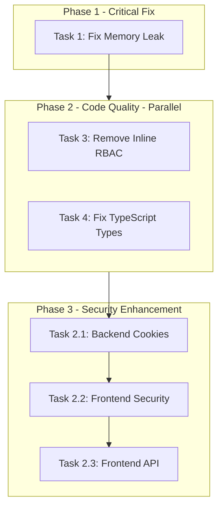

# Security and Code Quality Improvements Implementation Plan

**Status**: DRAFT  
**Created**: 2025-11-25  
**Last Updated**: 2025-11-25  
**Based On**: [security_improvements_analysis.md](.kilocode/plans/security_improvements_analysis.md)

---

## Overview

This plan addresses 4 identified security and code quality issues from the completed analysis. Two issues identified in the original scope (error handling consistency and rate limiting cleanup) have been verified as already resolved and require no action.

### Scope Summary

| Task | Priority | Risk | Files Affected |
|------|----------|------|----------------|
| Task 1: Fix defer-in-loop memory leak | CRITICAL | LOW | 1 file |
| Task 2: Migrate JWT to HttpOnly cookies | HIGH | MEDIUM | 3 files |
| Task 3: Remove redundant inline RBAC | LOW | LOW | 2 files |
| Task 4: Fix TypeScript any type | LOW | LOW | 1 file |

### Resolved Issues (No Action Required)

- **Error Handling**: Already consistent using [`echo.NewHTTPError()`](internal/handlers/auth_handlers.go) pattern
- **Rate Limiting**: Already has proper cleanup goroutine in [`internal/middleware/rate_limit.go`](internal/middleware/rate_limit.go)

---

## Implementation Tasks

### Task 1: Fix defer-in-loop Memory Leak (CRITICAL)

**Status**: NOT_STARTED  
**Priority**: CRITICAL  
**Risk Level**: LOW  
**Estimated Complexity**: LOW

#### Description

Fix memory leak caused by `defer cancel()` inside infinite `for range ticker.C` loop. Deferred functions never execute in infinite loops, causing context cancellation functions to accumulate indefinitely.

#### Files to Modify

| File | Lines | Change |
|------|-------|--------|
| [`cmd/main.go`](cmd/main.go:750-752) | 750-752 | Replace `defer cancel()` with direct `cancel()` call |

#### Current Code (Lines 750-752)

```go
for range ticker.C {
    ctx, cancel := context.WithTimeout(context.Background(), 5*time.Minute)
    defer cancel()  // BUG: defer accumulates, never called
```

#### Target Code

```go
for range ticker.C {
    ctx, cancel := context.WithTimeout(context.Background(), 5*time.Minute)
    
    // ... use ctx for operations ...
    
    cancel()  // Call directly after context usage, not via defer
}
```

#### Acceptance Criteria

- [ ] `defer cancel()` is removed from the loop
- [ ] `cancel()` is called directly after context usage completes
- [ ] All code paths within the loop iteration call `cancel()` before next iteration
- [ ] Application compiles without errors
- [ ] No goroutine/memory leaks during extended runtime

#### Verification Steps

1. Verify code compiles: `go build ./cmd/...`
2. Check for race conditions: `go build -race ./cmd/...`
3. Run application and monitor memory over time
4. Verify context operations complete properly

---

### Task 2: Migrate JWT to HttpOnly Cookies (HIGH)

**Status**: NOT_STARTED  
**Priority**: HIGH  
**Risk Level**: MEDIUM  
**Estimated Complexity**: MEDIUM

#### Description

Migrate refresh token storage from localStorage to HttpOnly cookies to prevent XSS token theft. Access tokens can remain in memory (short-lived).

#### Files to Modify

| File | Change Type | Description |
|------|-------------|-------------|
| [`internal/handlers/auth_handlers.go`](internal/handlers/auth_handlers.go) | Modify | Add HttpOnly cookie setting for refresh token |
| [`frontend/lib/security.ts`](frontend/lib/security.ts:36-43) | Modify | Remove localStorage usage for refresh token |
| [`frontend/lib/api.ts`](frontend/lib/api.ts) | Modify | Update token refresh flow to use cookies |

#### Subtask 2.1: Backend Cookie Implementation

**File**: [`internal/handlers/auth_handlers.go`](internal/handlers/auth_handlers.go)

**Changes**:
1. In login/register handlers, set refresh token as HttpOnly cookie:
   ```go
   cookie := new(http.Cookie)
   cookie.Name = "refresh_token"
   cookie.Value = refreshToken
   cookie.HttpOnly = true
   cookie.Secure = true  // HTTPS only
   cookie.SameSite = http.SameSiteStrictMode
   cookie.Path = "/api/v1/auth"
   cookie.MaxAge = 24 * 60 * 60  // 24 hours
   c.SetCookie(cookie)
   ```

2. In refresh endpoint, read refresh token from cookie instead of request body
3. In logout endpoint, clear the cookie

**Acceptance Criteria**:
- [ ] Login sets refresh token as HttpOnly cookie
- [ ] Refresh endpoint reads token from cookie
- [ ] Logout clears the cookie
- [ ] Cookie has Secure, HttpOnly, SameSite=Strict flags
- [ ] Backend still accepts header-based auth during migration (backward compatibility)

#### Subtask 2.2: Frontend Token Storage Migration

**File**: [`frontend/lib/security.ts`](frontend/lib/security.ts:36-43)

**Changes**:
1. Remove `localStorage.setItem('refresh_token', ...)` calls
2. Keep access token in memory only (class property)
3. Update `clearTokens()` to only clear memory, not localStorage
4. Add method to check if user is authenticated (via refresh attempt)

**Acceptance Criteria**:
- [ ] Refresh token is NOT stored in localStorage
- [ ] Access token stored only in memory
- [ ] Token manager handles page refresh (calls refresh endpoint)
- [ ] `clearTokens()` properly clears memory

#### Subtask 2.3: Frontend API Refresh Flow

**File**: [`frontend/lib/api.ts`](frontend/lib/api.ts)

**Changes**:
1. Update refresh interceptor to call `/auth/refresh` without sending token in body
2. Ensure `credentials: 'include'` is set for cookie transmission
3. Handle refresh failures (redirect to login)

**Acceptance Criteria**:
- [ ] API client sends cookies with requests (`credentials: 'include'`)
- [ ] Refresh flow works without localStorage
- [ ] Failed refresh redirects to login
- [ ] Access token is refreshed before expiry

#### Migration Strategy

1. Deploy backend first (accepts both cookie and header for refresh token)
2. Deploy frontend (uses cookie-based refresh)
3. Remove header-based refresh support after all clients updated

#### Rollback Plan

- Revert frontend to localStorage usage
- Backend continues to work with both methods

---

### Task 3: Remove Redundant Inline RBAC (LOW)

**Status**: NOT_STARTED  
**Priority**: LOW  
**Risk Level**: LOW  
**Estimated Complexity**: LOW

#### Description

Remove inline RBAC permission checks from handler methods since route-level middleware already enforces permissions. The inline checks are redundant and add unnecessary code complexity.

#### Files to Modify

| File | Occurrences | Change |
|------|-------------|--------|
| [`internal/handlers/suppliers_handlers.go`](internal/handlers/suppliers_handlers.go:34-41) | 5 methods | Remove inline RBAC blocks |
| [`internal/handlers/distributors_handlers.go`](internal/handlers/distributors_handlers.go:34-41) | 5 methods | Remove inline RBAC blocks |

#### Current Pattern (to remove)

```go
// Remove this block from each handler method:
err := h.rbacMiddleware.RequirePermission("supplier.list")(func(c echo.Context) error {
    return nil
})(c)
if err != nil {
    return err
}
```

#### Route-Level RBAC (already exists in main.go)

```go
// This protection remains in place:
protected.GET("/suppliers", supplierHandlers.ListSuppliers, rbacMiddleware.RequirePermission("supplier.list"))
```

#### Methods to Update

**suppliers_handlers.go**:
- [ ] `ListSuppliers()` - remove inline "supplier.list" check
- [ ] `GetSupplier()` - remove inline "supplier.view" check
- [ ] `CreateSupplier()` - remove inline "supplier.create" check
- [ ] `UpdateSupplier()` - remove inline "supplier.update" check
- [ ] `DeleteSupplier()` - remove inline "supplier.delete" check

**distributors_handlers.go**:
- [ ] `ListDistributors()` - remove inline "distributor.list" check
- [ ] `GetDistributor()` - remove inline "distributor.view" check
- [ ] `CreateDistributor()` - remove inline "distributor.create" check
- [ ] `UpdateDistributor()` - remove inline "distributor.update" check
- [ ] `DeleteDistributor()` - remove inline "distributor.delete" check

#### Acceptance Criteria

- [ ] All inline RBAC blocks removed from suppliers_handlers.go
- [ ] All inline RBAC blocks removed from distributors_handlers.go
- [ ] Route-level RBAC middleware still applied in main.go
- [ ] All endpoints still require authentication
- [ ] All endpoints still enforce correct permissions
- [ ] Existing tests pass

#### Verification Steps

1. Verify route-level RBAC exists in [`cmd/main.go`](cmd/main.go:652-731)
2. Test each endpoint with:
   - Unauthenticated request (should return 401)
   - Authenticated user without permission (should return 403)
   - Authenticated user with permission (should succeed)

---

### Task 4: Fix TypeScript any Type (LOW)

**Status**: NOT_STARTED  
**Priority**: LOW  
**Risk Level**: LOW  
**Estimated Complexity**: LOW

#### Description

Replace `any` type with proper `Category` interface in ProductForm component for improved type safety.

#### Files to Modify

| File | Line | Change |
|------|------|--------|
| [`frontend/components/products/ProductForm.tsx`](frontend/components/products/ProductForm.tsx:102) | 102 | Replace `any` with `Category` type |

#### Current Code (Line 102)

```typescript
{categories?.categories?.map((cat: any) => (
```

#### Target Code

```typescript
import { Category } from '@/types';  // Add import if not present

// Line 102:
{categories?.categories?.map((cat: Category) => (
```

#### Acceptance Criteria

- [ ] `Category` type imported from types file
- [ ] `any` replaced with `Category` on line 102
- [ ] TypeScript compilation succeeds: `npm run build`
- [ ] No type errors in ProductForm component
- [ ] Component behavior unchanged

#### Verification Steps

1. Run TypeScript compiler: `cd frontend && npm run build`
2. Verify no type errors
3. Test ProductForm renders correctly with categories

---

## Execution Order



**Recommended Order**:
1. **Task 1** (Critical) - Fix memory leak first
2. **Task 3 + Task 4** (Low priority, can parallelize) - Quick code quality wins
3. **Task 2** (High priority but complex) - JWT migration requires careful testing

---

## Testing Strategy

### Unit Tests

| Task | Test Type | Description |
|------|-----------|-------------|
| Task 1 | Manual | Monitor memory usage during extended runtime |
| Task 2 | Integration | Test full auth flow with cookies |
| Task 3 | Integration | Test RBAC enforcement on all endpoints |
| Task 4 | Type Check | TypeScript compilation |

### Integration Tests

- Full authentication flow with cookie-based refresh
- RBAC permission checks on supplier/distributor endpoints
- Application startup and health checks

### Manual Verification

- [ ] Application starts without errors
- [ ] Memory usage stable over time (Task 1)
- [ ] Login/logout works with cookies (Task 2)
- [ ] Refresh token not visible in browser localStorage (Task 2)
- [ ] Supplier endpoints require correct permissions (Task 3)
- [ ] Distributor endpoints require correct permissions (Task 3)
- [ ] ProductForm displays categories correctly (Task 4)

---

## Rollback Plan

### Task 1 (Memory Leak)

- Single file change, easy git revert
- No external dependencies

### Task 2 (JWT Cookies)

- Backend can support both cookie and header auth during transition
- Frontend can revert to localStorage if needed
- Recommend keeping backward compatibility for 1 release cycle

### Task 3 (Inline RBAC)

- Git revert if issues found
- Route-level RBAC remains unchanged

### Task 4 (TypeScript Types)

- Git revert if issues found
- No runtime impact

---

## Completion Checklist

- [ ] Task 1: Memory leak fixed and verified
- [ ] Task 2: JWT cookies implemented and tested
- [ ] Task 3: Inline RBAC removed, endpoints still protected
- [ ] Task 4: TypeScript types fixed, build passes
- [ ] All existing tests pass
- [ ] No new security vulnerabilities introduced
- [ ] Documentation updated if needed

---

## Notes

### What's NOT in Scope

- Error handling improvements (already consistent)
- Rate limiting changes (already has proper cleanup)
- New feature development
- Performance optimizations beyond memory leak fix

### Dependencies

- Task 2 requires CORS configuration to support cookies across domains if frontend/backend on different origins
- Task 2 may require HTTPS in development for Secure cookie flag testing

### References

- Analysis Document: [security_improvements_analysis.md](.kilocode/plans/security_improvements_analysis.md)
- Auth Handlers: [`internal/handlers/auth_handlers.go`](internal/handlers/auth_handlers.go)
- Security Module: [`frontend/lib/security.ts`](frontend/lib/security.ts)
- RBAC Middleware: [`internal/middleware/rbac.go`](internal/middleware/rbac.go)