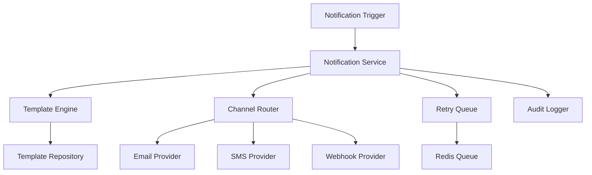
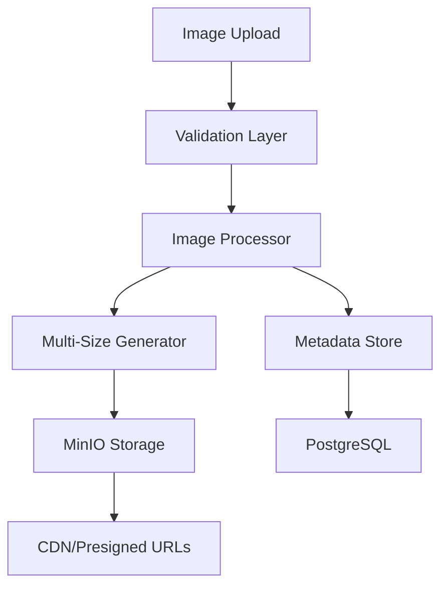
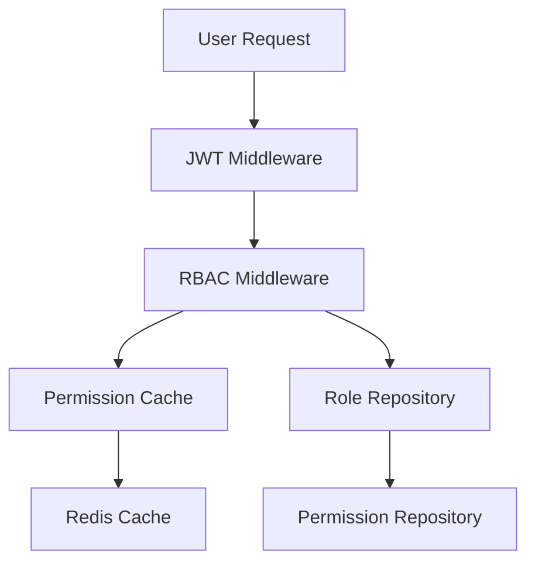

# Design Document

## Overview

This design document outlines the architecture and implementation approach for completing the missing features and fixing identified bugs in the AgroMart inventory management system. The design focuses on creating a robust, scalable, and maintainable solution that addresses all identified gaps while maintaining the existing system architecture.

## Architecture

### Current System Architecture

The AgroMart system follows a layered architecture pattern:

```
Frontend (Next.js/React) → API Gateway (Echo) → Services → Repositories → Database (PostgreSQL)
                                                     ↓
                                              External Services (MinIO, Redis, Razorpay)
```

### Enhanced Architecture Components

#### 1. Notification System Architecture



#### 2. Image Management Architecture



#### 3. RBAC Enhancement Architecture



## Components and Interfaces

### 1. Enhanced Notification System

#### NotificationService Interface Extensions
```go
type NotificationService interface {
    // Existing methods...
    
    // Enhanced template management
    CreateTemplate(ctx context.Context, tenantID uuid.UUID, template *models.NotificationTemplate) error
    ValidateTemplate(template *models.NotificationTemplate) error
    RenderTemplateWithValidation(template *models.NotificationTemplate, data map[string]interface{}) (string, error)
    
    // Enhanced webhook management
    ValidateWebhookURL(url string) error
    TestWebhookConnection(ctx context.Context, webhook *models.WebhookSubscription) error
    
    // Alert configuration
    CreateAlertRule(ctx context.Context, tenantID uuid.UUID, rule *models.AlertRule) error
    EvaluateAlertRules(ctx context.Context, tenantID uuid.UUID, eventType string, data map[string]interface{}) error
}
```

#### New Repository Interfaces
```go
type NotificationRepository interface {
    Create(ctx context.Context, notification *models.Notification) error
    Update(ctx context.Context, notification *models.Notification) error
    GetByID(ctx context.Context, tenantID uuid.UUID, id string) (*models.Notification, error)
    List(ctx context.Context, tenantID uuid.UUID, filters NotificationFilters) ([]*models.Notification, error)
    MarkAsRead(ctx context.Context, tenantID uuid.UUID, id string) error
    Delete(ctx context.Context, tenantID uuid.UUID, id string) error
}

type NotificationTemplateRepository interface {
    Create(ctx context.Context, template *models.NotificationTemplate) error
    Update(ctx context.Context, template *models.NotificationTemplate) error
    GetByID(ctx context.Context, tenantID uuid.UUID, id string) (*models.NotificationTemplate, error)
    List(ctx context.Context, tenantID uuid.UUID, eventType string) ([]*models.NotificationTemplate, error)
    Delete(ctx context.Context, tenantID uuid.UUID, id string) error
}
```

### 2. Fixed Image Management System

#### Enhanced ProductImageService
```go
type ProductImageService interface {
    UploadImage(ctx context.Context, tenantID, productID uuid.UUID, file ImageFile) (*models.ProductImage, error)
    GetImages(ctx context.Context, tenantID, productID uuid.UUID) ([]*models.ProductImage, error)
    GetImageURL(ctx context.Context, tenantID, imageID uuid.UUID, size ImageSize) (string, error)
    DeleteImage(ctx context.Context, tenantID, imageID uuid.UUID) error
    OptimizeImage(imageData []byte, config ImageOptimizationConfig) ([]byte, error)
}

type ImageFile struct {
    Filename string
    Content  io.Reader
    Size     int64
    MimeType string
}

type ImageSize string
const (
    ImageSizeOriginal ImageSize = "original"
    ImageSizeLarge    ImageSize = "large"    // 1920px
    ImageSizeMedium   ImageSize = "medium"   // 800px
    ImageSizeSmall    ImageSize = "small"    // 300px
    ImageSizeThumbnail ImageSize = "thumbnail" // 150px
)
```

### 3. Complete Frontend Components

#### New React Components Structure
```
frontend/components/
├── notifications/
│   ├── NotificationCenter.tsx
│   ├── NotificationTemplateEditor.tsx
│   ├── WebhookSubscriptionManager.tsx
│   └── AlertConfigurationPanel.tsx
├── subscriptions/
│   ├── SubscriptionDashboard.tsx
│   ├── PlanSelector.tsx
│   ├── BillingHistory.tsx
│   └── PaymentMethodManager.tsx
├── analytics/
│   ├── DashboardCharts.tsx
│   ├── SalesTrendChart.tsx
│   ├── InventoryAnalytics.tsx
│   └── RevenueAnalytics.tsx
└── rbac/
    ├── RoleManager.tsx
    ├── PermissionMatrix.tsx
    └── UserRoleAssignment.tsx
```

### 4. Enhanced RBAC System

#### Permission Management
```go
type RBACService interface {
    // Existing methods...
    
    // Enhanced permission checking
    HasPermissionWithContext(ctx context.Context, userID, tenantID uuid.UUID, resource, action string, context map[string]interface{}) (bool, error)
    GetUserPermissions(ctx context.Context, userID, tenantID uuid.UUID) ([]Permission, error)
    
    // Role management
    CreateRole(ctx context.Context, tenantID uuid.UUID, role *models.Role) error
    AssignPermissionsToRole(ctx context.Context, tenantID, roleID uuid.UUID, permissions []uuid.UUID) error
    
    // Audit
    LogPermissionCheck(ctx context.Context, userID, tenantID uuid.UUID, resource, action string, granted bool) error
}
```

## Data Models

### 1. Enhanced Notification Models

```go
type NotificationTemplate struct {
    ID           string                 `json:"id" db:"id"`
    TenantID     string                 `json:"tenant_id" db:"tenant_id"`
    Name         string                 `json:"name" db:"name"`
    Type         NotificationType       `json:"type" db:"type"`
    EventType    string                 `json:"event_type" db:"event_type"`
    Subject      *string                `json:"subject" db:"subject"`
    BodyTemplate string                 `json:"body_template" db:"body_template"`
    Variables    map[string]interface{} `json:"variables" db:"variables"`
    IsActive     bool                   `json:"is_active" db:"is_active"`
    CreatedAt    time.Time              `json:"created_at" db:"created_at"`
    UpdatedAt    time.Time              `json:"updated_at" db:"updated_at"`
}

type AlertRule struct {
    ID          string                 `json:"id" db:"id"`
    TenantID    string                 `json:"tenant_id" db:"tenant_id"`
    Name        string                 `json:"name" db:"name"`
    EventType   string                 `json:"event_type" db:"event_type"`
    Conditions  map[string]interface{} `json:"conditions" db:"conditions"`
    Actions     []AlertAction          `json:"actions" db:"actions"`
    IsActive    bool                   `json:"is_active" db:"is_active"`
    CreatedAt   time.Time              `json:"created_at" db:"created_at"`
    UpdatedAt   time.Time              `json:"updated_at" db:"updated_at"`
}

type AlertAction struct {
    Type         string                 `json:"type"`         // email, sms, webhook
    Target       string                 `json:"target"`       // recipient or webhook ID
    TemplateID   *string                `json:"template_id"`
    CustomData   map[string]interface{} `json:"custom_data"`
}
```

### 2. Enhanced Product Image Models

```go
type ProductImage struct {
    ID          uuid.UUID  `json:"id" db:"id"`
    TenantID    uuid.UUID  `json:"tenant_id" db:"tenant_id"`
    ProductID   uuid.UUID  `json:"product_id" db:"product_id"`
    OriginalURL string     `json:"original_url" db:"original_url"`
    LargeURL    string     `json:"large_url" db:"large_url"`
    MediumURL   string     `json:"medium_url" db:"medium_url"`
    SmallURL    string     `json:"small_url" db:"small_url"`
    ThumbnailURL string    `json:"thumbnail_url" db:"thumbnail_url"`
    AltText     *string    `json:"alt_text" db:"alt_text"`
    FileSize    int64      `json:"file_size" db:"file_size"`
    MimeType    string     `json:"mime_type" db:"mime_type"`
    Width       int        `json:"width" db:"width"`
    Height      int        `json:"height" db:"height"`
    CreatedAt   time.Time  `json:"created_at" db:"created_at"`
    UpdatedAt   time.Time  `json:"updated_at" db:"updated_at"`
}
```

### 3. Enhanced RBAC Models

```go
type Permission struct {
    ID          uuid.UUID `json:"id" db:"id"`
    Name        string    `json:"name" db:"name"`
    Resource    string    `json:"resource" db:"resource"`
    Action      string    `json:"action" db:"action"`
    Conditions  JSONB     `json:"conditions" db:"conditions"`
    Description *string   `json:"description" db:"description"`
    CreatedAt   time.Time `json:"created_at" db:"created_at"`
}

type RolePermission struct {
    RoleID       uuid.UUID `json:"role_id" db:"role_id"`
    PermissionID uuid.UUID `json:"permission_id" db:"permission_id"`
    Conditions   JSONB     `json:"conditions" db:"conditions"`
    GrantedAt    time.Time `json:"granted_at" db:"granted_at"`
}
```

## Error Handling

### 1. Centralized Error Management

```go
type ErrorHandler interface {
    HandleError(ctx context.Context, err error, operation string) error
    LogError(ctx context.Context, err error, metadata map[string]interface{})
    NotifyAdmins(ctx context.Context, err error, severity ErrorSeverity)
}

type ErrorSeverity string
const (
    ErrorSeverityLow      ErrorSeverity = "low"
    ErrorSeverityMedium   ErrorSeverity = "medium"
    ErrorSeverityHigh     ErrorSeverity = "high"
    ErrorSeverityCritical ErrorSeverity = "critical"
)
```

### 2. Error Response Format

```go
type APIError struct {
    Code      string                 `json:"code"`
    Message   string                 `json:"message"`
    Details   map[string]interface{} `json:"details,omitempty"`
    Timestamp time.Time              `json:"timestamp"`
    RequestID string                 `json:"request_id"`
}
```

## Testing Strategy

### 1. Unit Testing

- **Coverage Target**: 80% minimum for all services and repositories
- **Test Structure**: Table-driven tests with comprehensive edge cases
- **Mocking**: Use interfaces for all external dependencies

### 2. Integration Testing

- **Database Tests**: Use test containers for PostgreSQL
- **API Tests**: End-to-end API testing with real database
- **External Service Tests**: Mock external services (MinIO, Redis, Razorpay)

### 3. Frontend Testing

- **Component Tests**: React Testing Library for all components
- **E2E Tests**: Playwright for critical user flows
- **Visual Regression**: Chromatic for UI consistency

### 4. Performance Testing

- **Load Testing**: Artillery.js for API endpoints
- **Database Performance**: Query optimization and index analysis
- **Memory Profiling**: Go pprof for memory leak detection

## Security Considerations

### 1. Authentication & Authorization

- **JWT Security**: Proper token validation and refresh mechanisms
- **RBAC Enhancement**: Context-aware permission checking
- **Audit Logging**: Comprehensive security event logging

### 2. Data Protection

- **Tenant Isolation**: Strict data separation between tenants
- **Input Validation**: Comprehensive request validation
- **SQL Injection Prevention**: Parameterized queries only

### 3. File Upload Security

- **File Type Validation**: Strict MIME type checking
- **Size Limits**: Configurable upload size limits
- **Virus Scanning**: Integration with antivirus services (future)

## Performance Optimization

### 1. Caching Strategy

- **Redis Caching**: Multi-level caching for frequently accessed data
- **Cache Invalidation**: Event-driven cache invalidation
- **Cache Warming**: Proactive cache population

### 2. Database Optimization

- **Index Strategy**: Comprehensive indexing for query performance
- **Connection Pooling**: Optimized connection pool configuration
- **Query Optimization**: Analyze and optimize slow queries

### 3. Image Processing

- **Async Processing**: Background image optimization
- **CDN Integration**: Content delivery network for images
- **Lazy Loading**: Frontend lazy loading for images

## Deployment Strategy

### 1. Database Migrations

- **Migration Scripts**: Comprehensive database schema updates
- **Rollback Strategy**: Safe rollback procedures for failed migrations
- **Data Migration**: Scripts for existing data transformation

### 2. Feature Flags

- **Gradual Rollout**: Feature flags for new functionality
- **A/B Testing**: Support for feature experimentation
- **Emergency Rollback**: Quick feature disabling capability

### 3. Monitoring & Observability

- **Health Checks**: Comprehensive health monitoring
- **Metrics Collection**: Business and technical metrics
- **Alerting**: Proactive alerting for system issues

## Implementation Phases

### Phase 1: Core Infrastructure (Week 1-2)
- Database schema updates
- Enhanced error handling
- Logging improvements
- Basic testing framework

### Phase 2: Notification System (Week 3-4)
- Complete notification service implementation
- Template management
- Webhook subscriptions
- Alert configurations

### Phase 3: Image Management Fix (Week 5)
- Fix UUID parsing bug
- Enhanced image processing
- Multi-size image generation
- Improved error handling

### Phase 4: Frontend Components (Week 6-8)
- Notification management UI
- Subscription management UI
- Enhanced analytics dashboard
- RBAC management interface

### Phase 5: RBAC Enhancement (Week 9-10)
- Enhanced permission system
- Role management improvements
- Audit logging
- Security testing

### Phase 6: Testing & Documentation (Week 11-12)
- Comprehensive test suite
- API documentation updates
- Performance optimization
- Security audit

This design provides a comprehensive roadmap for completing the AgroMart system while maintaining high standards for security, performance, and maintainability.