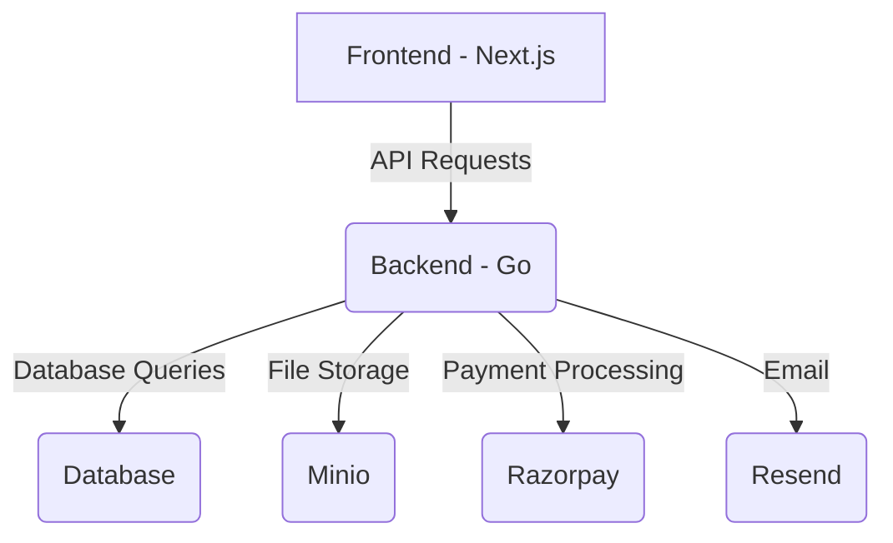

# Codebase Analysis Report

## 1. High-Level Structure

The application is a monolith with a clear separation between the frontend and backend. The backend is a Go application, and the frontend is a Next.js application.

## 2. Technology Stack

### Backend

- **Language:** Go
- **Framework:** Echo
- **Database:** PostgreSQL (based on `pgx` driver)
- **Job Queue:** Asynq
- **Object Storage:** Minio
- **Payments:** Razorpay
- **Email:** Resend
- **Testing:** Testify

### Frontend

- **Framework:** Next.js
- **Language:** TypeScript
- **UI:** React, Tailwind CSS, Recharts
- **State Management:** React Query
- **Testing:** Jest, React Testing Library

## 3. Key Features

- **Authentication:** User registration, login, and JWT-based authentication.
- **Product Management:** CRUD operations for products, including image uploads.
- **Order Management:** Creating and managing orders.
- **Inventory Management:** Tracking stock levels.
- **User Management:** Managing users and roles.
- **Multi-tenancy:** Support for multiple tenants.
- **Background Jobs:** Asynchronous jobs for tasks like analytics and notifications.
- **Audit Logs:** Tracking user actions.

## 4. Missing Features

- **Permissions Management:** While there are `permissions` and `roles` pages, the implementation seems incomplete.
- **Webhooks:** The `webhooks` feature is present but appears to be a stub.
- **Subscriptions:** The `subscriptions` feature is present but appears to be a stub.
- **Analytics:** The `analytics` page is a stub.

## 5. Potential Issues

- **Lack of Tests:** There is a noticeable lack of tests in both the frontend and backend.
- **Inconsistent Coding Styles:** There are some inconsistencies in coding styles, particularly in the frontend.
- **Technical Debt:** There are several `TODO` comments in the code that indicate technical debt.
