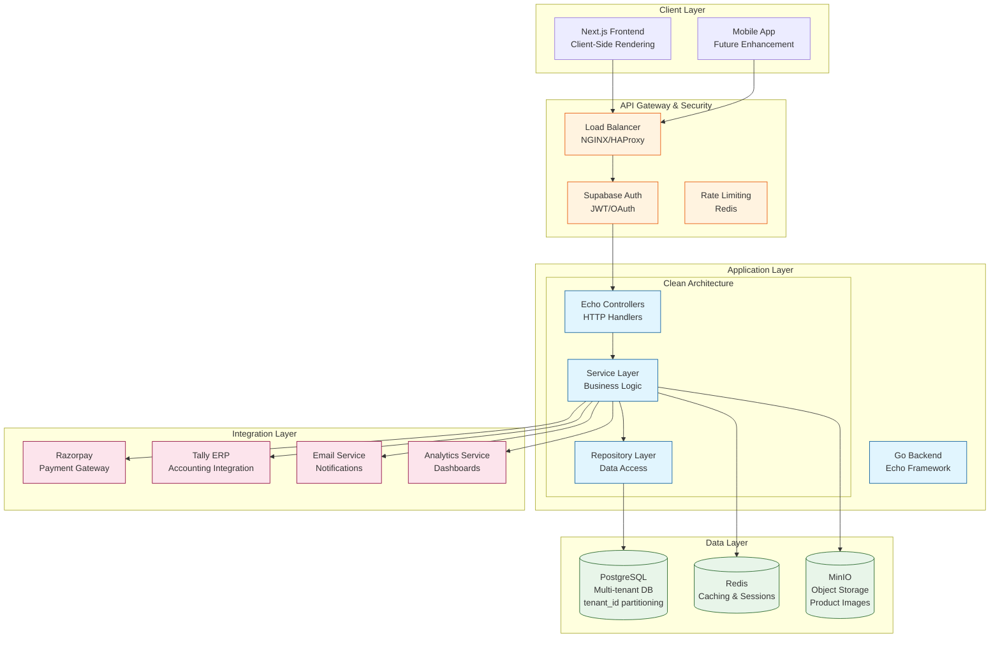
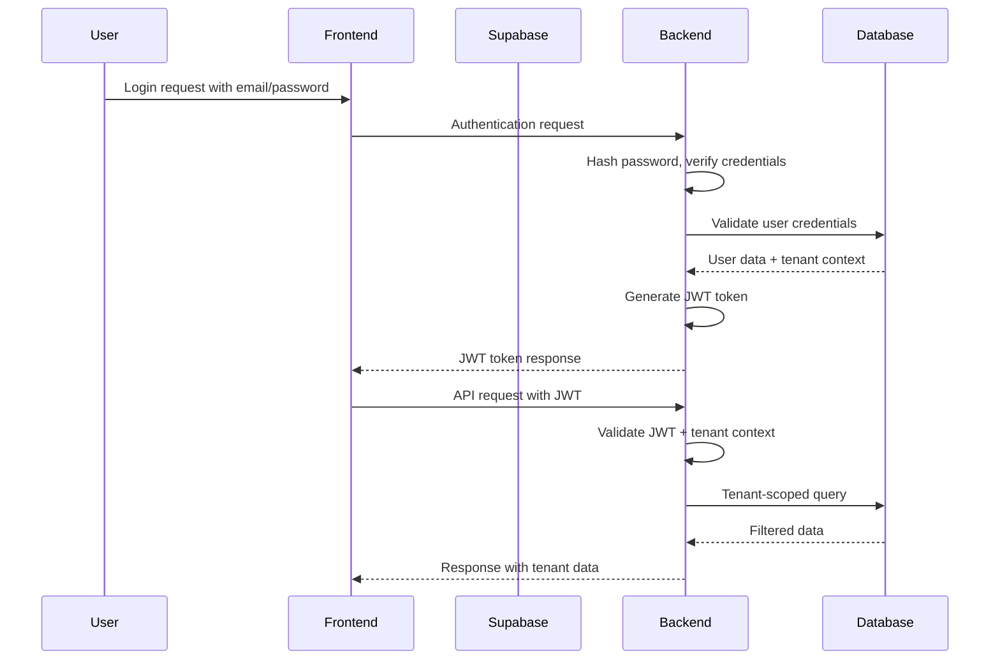
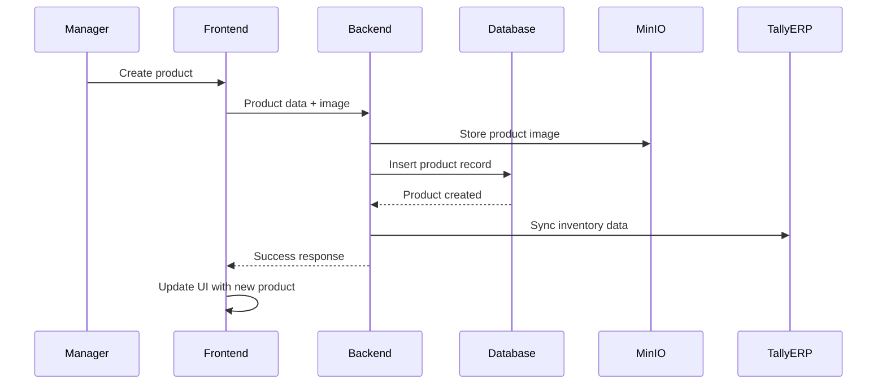
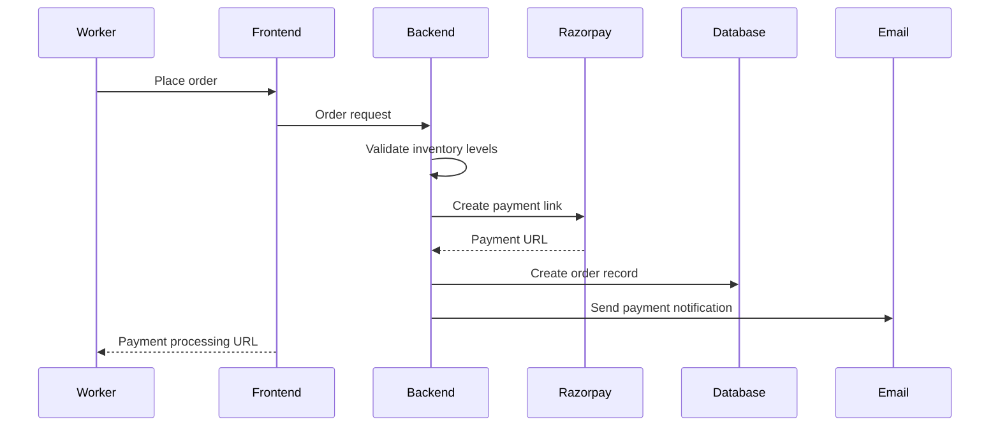
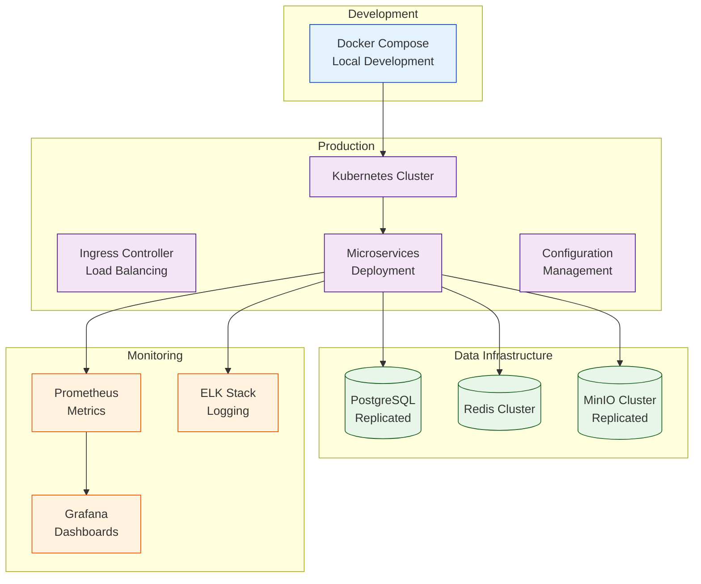

# Multi-Tenant SaaS Inventory Management Platform - Architecture Design

## System Overview

This platform provides cloud-based inventory management for AgroTech companies, enabling efficient tracking of agricultural supplies, equipment, and resources across distributed operations. The system supports multiple tenants with isolated data, role-based access control, and integrations with ERP systems and payment processors.

**Key Capabilities:**
- Product catalog management (seeds, fertilizers, pesticides, equipment)
- Real-time stock tracking and alerts
- Order and requisition management
- Supplier relationship management
- Compliance reporting and auditing
- Multi-tenant data isolation

**Target Scale:**
- 10-20 initial tenants
- Projected 5x growth (50-100 tenants) within first year
- Support for up to 500 concurrent users per tenant

## Architecture Diagram



## Key Components

### Backend Architecture (Clean Architecture)

1. **Controllers Layer**
   - Echo HTTP handlers
   - Request validation and routing
   - Response formatting
   - Middleware for CORS, logging, authentication

2. **Service Layer**
   - Business logic implementation
   - Multi-tenant context handling
   - Transaction coordination
   - Integration orchestration

3. **Repository Layer**
   - Data access abstraction
   - Query optimization with pgx
   - Tenant-scoped data access
   - Connection pooling

### Database Design (PostgreSQL)

**Multi-Tenant Strategy:**
- Shared database with tenant_id column
- Row-Level Security (RLS) policies
- Tenant-scoped indexes for performance
- Partitioning by tenant_id for large-scale growth

**Key Tables:**
```sql
-- Core tenant structure
CREATE TABLE tenants (
    id UUID PRIMARY KEY,
    name VARCHAR(255) NOT NULL,
    subdomain VARCHAR(100) UNIQUE,
    status VARCHAR(50) DEFAULT 'active',
    created_at TIMESTAMP DEFAULT NOW()
);

-- Tenant-scoped inventory
CREATE TABLE products (
    id UUID PRIMARY KEY,
    tenant_id UUID NOT NULL REFERENCES tenants(id),
    name VARCHAR(255) NOT NULL,
    category VARCHAR(100),
    unit_of_measure VARCHAR(50),
    -- ... additional fields
);

-- Multi-tenant user management
CREATE TABLE users (
    id UUID PRIMARY KEY,
    tenant_id UUID NOT NULL REFERENCES tenants(id),
    email VARCHAR(255) UNIQUE NOT NULL,
    role VARCHAR(50) NOT NULL, -- admin, manager, worker, supplier
    -- ... additional fields
);
```

### Frontend Architecture (Next.js)

**Technology Stack:**
- Next.js 14+ with App Router
- TypeScript for type safety
- Tailwind CSS for styling
- React Query for data fetching
- Direct API integration for authentication and data access

**Application Structure:**
```
src/
├── app/                    # App Router pages
├── components/            # Reusable UI components
│   ├── inventory/         # Inventory-specific components
│   ├── orders/           # Order management components
│   └── common/           # Shared components
├── hooks/                # Custom React hooks
├── lib/                  # Utilities and configurations
│   ├── supabase/         # Supabase client
│   └── queries/          # API query functions
└── types/                # TypeScript definitions
```

## Data Flows

### 1. Authentication Flow


### 2. Inventory Management Flow


### 3. Order Processing Flow


## Integration Points

### 1. Payment Integration (Razorpay)
- Secure payment processing for orders
- Multiple payment methods (UPI, cards, net banking)
- Webhook handling for payment confirmations
- Refund and cancellation management

### 2. Accounting Integration (Tally ERP)
- Automated invoice generation
- Inventory cost tracking
- Financial reporting synchronization
- Tax compliance integration

### 3. Object Storage (MinIO)
- High-performance S3-compatible storage
- Product image management
- Document storage for compliance records
- CDN integration for faster delivery

## Security Considerations

### Multi-Tenant Security
- **Data Isolation**: Row-Level Security (RLS) policies
- **Tenant Context**: Mandatory tenant_id in all queries
- **Access Control**: Role-based permissions (Admin, Manager, Worker, Supplier)
- **Audit Logging**: Comprehensive action tracking per tenant

### Application Security
- **Authentication**: Password-based with JWT tokens and bcrypt hashing
- **Authorization**: Permission-based access control
- **API Security**: Rate limiting, CORS configuration, input validation
- **Data Protection**: Encryption at rest and in transit

### Infrastructure Security
- **Network Security**: VPC isolation, security groups
- **Encryption**: TLS 1.3 for all communications
- **Monitoring**: Security event logging and alerting
- **Compliance**: GDPR, local regulations for agricultural data

## Scalability Optimizations

### Database Scalability
- **Connection Pooling**: Efficient connection management
- **Query Optimization**: Strategic indexing on tenant_id + common filters
- **Partitioning Strategy**: Range partitioning by tenant_id
- **Read Replicas**: Offload reporting queries

### Application Scalability
- **Microservices Design**: Service decomposition for horizontal scaling
- **Caching Strategy**:
  - Redis for session management
  - Application-level caching for frequently accessed data
  - CDN for static assets

### Infrastructure Scalability
- **Container Orchestration**: Docker Compose for development, Kubernetes for production
- **Auto-scaling**: Based on CPU/memory metrics
- **Load Balancing**: Multi-region deployment capability
- **Database Sharding**: Future-ready for 100+ tenants

## Deployment Architecture



## Performance Optimization Strategies

### Query Optimization
- Database indexes on frequent query patterns
- Query result caching with Redis
- Asynchronous processing for heavy operations
- Database connection pooling optimization

### Frontend Optimization
- Client-side rendering with strategic hydration
- Image optimization and lazy loading
- React Query for efficient data fetching
- Progressive Web App (PWA) capabilities

### Caching Strategy
- Application cache: Redis for user sessions and frequently accessed data
- Database cache: PostgreSQL shared buffers and query caching
- CDN cache: Static assets and image delivery
- API response cache: Short-term caching for list endpoints

## Compliance and Regulatory Consideration

### Agricultural Compliance
- Traceability requirements for agricultural products
- Quality control documentation
- Environmental compliance tracking
- Food safety standards integration

### Data Privacy
- Tenant data isolation enforcement
- Data retention policies per tenant
- Audit trails for all inventory transactions
- Export capabilities for regulatory reporting

## Rationale and Decision Factors

### Technology Choices
- **Go/Echo**: High performance, excellent concurrency, clean architecture support
- **PostgreSQL**: Robust multi-tenant support, advanced querying, ACID compliance
- **Next.js**: Rapid development, SEO benefits, excellent React ecosystem
- **PostgreSQL**: Advanced database features, multi-tenancy support, ACID compliance
- **MinIO**: S3-compatible, open-source, high performance for file storage

### Multi-Tenant Architecture
- **Shared Database**: Lower operational complexity for initial scale (10-20 tenants)
- **Tenant_id Partitioning**: Future scalability to 100+ tenants
- **RLS Policies**: Row-level data isolation without application changes
- **Connection Pooling**: Efficient resource utilization across tenants

### Scalability Considerations
- **Docker Compose**: Easy development setup matching production-like environment
- **Clean Architecture**: Maintainable codebase as team and features grow
- **Modular Design**: Independent scaling of services based on load patterns

This architecture provides a solid foundation for the AgroTech inventory management platform, balancing current requirements with future scalability needs while maintaining high standards for security, performance, and maintainability.