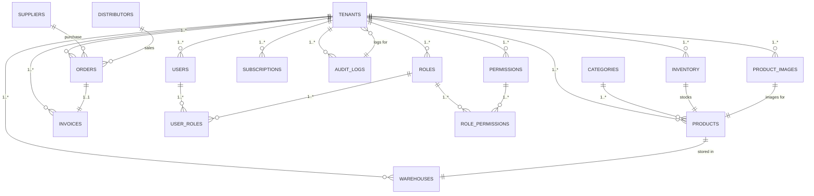

# PostgreSQL Database Schema for Multi-Tenant SaaS Inventory Management Platform

## Overview

This schema designs the PostgreSQL database for the inventory management platform, building on the previous high-level architecture. It enforces multi-tenancy through tenant_id in all tenant-specific tables. The design includes core tables for tenant management, users/roles/permissions, inventory (products, warehouses), orders (purchase/sales), billing (invoices, subscriptions), and audit (with partitioning). Data types, constraints, indexes, and foreign keys are defined for compliance, scalability, and performance. No farmer or batch traceability beyond basic product fields is included.

Rationale: Single PostgreSQL DB ensures efficient tenant isolation via tenant_id enforcement. pgx for queries supports performance. Razorpay subscriptions for billing. Tally ERP integration via order/invoice data. Scalability via indexes on tenant_id combinations, partitioning audit_logs by tenant_id (hash partitioning for even distribution across hundreds of tenants). Compliance enforced via license numbers and GST-related fields.

## Entity Relationship Diagram (Text-based ERD)


Notes: Cardinality shows 1..* for multiple instances; added SUPPORTING TABLES for completeness: SUPPLIERS, DISTRIBUTORS (for orders), CATEGORIES (for product normalization); added INVENTORY for stock tracking, PRODUCT_IMAGES for multiple product images; unified ORDERS for purchase/sales; AUDIT_LOGS partitioned by tenant_id.

## Table Definitions

### Tenants
```sql
CREATE TABLE tenants (
  id UUID PRIMARY KEY DEFAULT gen_random_uuid(),
  name VARCHAR(255) NOT NULL,
  subdomain VARCHAR(100) NOT NULL UNIQUE,
  license_number VARCHAR(100),
  status VARCHAR(50) DEFAULT 'active' NOT NULL CHECK (status IN ('active', 'inactive', 'suspended')),
  created_at TIMESTAMP DEFAULT NOW(),
  updated_at TIMESTAMP DEFAULT NOW()
);
```
Constraints: Status enum for valid values.

### Users
```sql
CREATE TABLE users (
  id UUID PRIMARY KEY DEFAULT gen_random_uuid(),
  tenant_id UUID NOT NULL REFERENCES tenants(id) ON DELETE CASCADE,
  email VARCHAR(255) NOT NULL UNIQUE,
  first_name VARCHAR(100) NOT NULL,
  last_name VARCHAR(100) NOT NULL,
  status VARCHAR(50) DEFAULT 'active' NOT NULL,
  created_at TIMESTAMP DEFAULT NOW(),
  updated_at TIMESTAMP DEFAULT NOW()
);
```

### Roles
```sql
CREATE TABLE roles (
  id UUID PRIMARY KEY DEFAULT gen_random_uuid(),
  tenant_id UUID NOT NULL REFERENCES tenants(id) ON DELETE CASCADE,
  name VARCHAR(100) NOT NULL,
  description TEXT,
  created_at TIMESTAMP DEFAULT NOW(),
  updated_at TIMESTAMP DEFAULT NOW(),
  UNIQUE (tenant_id, name)
);
```

### Permissions
```sql
CREATE TABLE permissions (
  id UUID PRIMARY KEY DEFAULT gen_random_uuid(),
  name VARCHAR(100) NOT NULL UNIQUE,
  description TEXT,
  created_at TIMESTAMP DEFAULT NOW()
);
```
Notes: Global permissions shared across tenants for consistent access control.

### User_Roles
```sql
CREATE TABLE user_roles (
  id UUID PRIMARY KEY DEFAULT gen_random_uuid(),
  user_id UUID NOT NULL REFERENCES users(id) ON DELETE CASCADE,
  role_id UUID NOT NULL REFERENCES roles(id) ON DELETE CASCADE,
  created_at TIMESTAMP DEFAULT NOW(),
  UNIQUE (user_id, role_id)
);
```

### Role_Permissions
```sql
CREATE TABLE role_permissions (
  id UUID PRIMARY KEY DEFAULT gen_random_uuid(),
  role_id UUID NOT NULL REFERENCES roles(id) ON DELETE CASCADE,
  permission_id UUID NOT NULL REFERENCES permissions(id) ON DELETE CASCADE,
  created_at TIMESTAMP DEFAULT NOW(),
  UNIQUE (role_id, permission_id)
);
```

### Categories (Supporting Table)
```sql
CREATE TABLE categories (
  id UUID PRIMARY KEY DEFAULT gen_random_uuid(),
  tenant_id UUID NOT NULL REFERENCES tenants(id) ON DELETE CASCADE,
  name VARCHAR(100) NOT NULL,
  description TEXT,
  created_at TIMESTAMP DEFAULT NOW(),
  updated_at TIMESTAMP DEFAULT NOW(),
  UNIQUE (tenant_id, name)
);
```

### Products
```sql
CREATE TABLE products (
  id UUID PRIMARY KEY DEFAULT gen_random_uuid(),
  tenant_id UUID NOT NULL REFERENCES tenants(id) ON DELETE CASCADE,
  category_id UUID REFERENCES categories(id),
  name VARCHAR(255) NOT NULL,
  batch_number VARCHAR(100),
  expiry_date DATE,
  quantity INTEGER DEFAULT 0 CHECK (quantity >= 0),
  unit_price DECIMAL(10,2) CHECK (unit_price >= 0),
  barcode VARCHAR(100) UNIQUE,
  unit_of_measure VARCHAR(50),
  description TEXT,
  created_at TIMESTAMP DEFAULT NOW(),
  updated_at TIMESTAMP DEFAULT NOW()
);
```
Constraints: Non-negative quantities and prices; unique barcode.

### Product_Images
```sql
CREATE TABLE product_images (
  id UUID PRIMARY KEY DEFAULT gen_random_uuid(),
  tenant_id UUID NOT NULL REFERENCES tenants(id) ON DELETE CASCADE,
  product_id UUID NOT NULL REFERENCES products(id) ON DELETE CASCADE,
  image_url VARCHAR(500) NOT NULL,
  alt_text VARCHAR(100),
  created_at TIMESTAMP DEFAULT NOW()
);
```
Notes: Allows multiple images per product, stored as URLs.

### Warehouses
```sql
CREATE TABLE warehouses (
  id UUID PRIMARY KEY DEFAULT gen_random_uuid(),
  tenant_id UUID NOT NULL REFERENCES tenants(id) ON DELETE CASCADE,
  name VARCHAR(255) NOT NULL,
  address TEXT,
  capacity INTEGER CHECK (capacity > 0),
  license_number VARCHAR(100),
  created_at TIMESTAMP DEFAULT NOW(),
  updated_at TIMESTAMP DEFAULT NOW(),
  UNIQUE (tenant_id, name)
);
```

### Inventory
```sql
CREATE TABLE inventory (
  id UUID PRIMARY KEY DEFAULT gen_random_uuid(),
  tenant_id UUID NOT NULL REFERENCES tenants(id) ON DELETE CASCADE,
  warehouse_id UUID NOT NULL REFERENCES warehouses(id) ON DELETE CASCADE,
  product_id UUID NOT NULL REFERENCES products(id) ON DELETE CASCADE,
  quantity INTEGER NOT NULL DEFAULT 0 CHECK (quantity >= 0),
  last_updated TIMESTAMP DEFAULT NOW(),
  UNIQUE (tenant_id, warehouse_id, product_id)
);
```
Notes: Tracks inventory at warehouse/product level per tenant; unique on tenant, warehouse, product to prevent duplicates.

### Suppliers (Supporting Table)
```sql
CREATE TABLE suppliers (
  id UUID PRIMARY KEY DEFAULT gen_random_uuid(),
  tenant_id UUID NOT NULL REFERENCES tenants(id) ON DELETE CASCADE,
  name VARCHAR(255) NOT NULL,
  contact_email VARCHAR(255),
  contact_phone VARCHAR(20),
  address TEXT,
  license_number VARCHAR(100),
  created_at TIMESTAMP DEFAULT NOW(),
  updated_at TIMESTAMP DEFAULT NOW()
);
```

### Distributors (Supporting Table)
```sql
CREATE TABLE distributors (
  id UUID PRIMARY KEY DEFAULT gen_random_uuid(),
  tenant_id UUID NOT NULL REFERENCES tenants(id) ON DELETE CASCADE,
  name VARCHAR(255) NOT NULL,
  contact_email VARCHAR(255),
  contact_phone VARCHAR(20),
  address TEXT,
  license_number VARCHAR(100),
  created_at TIMESTAMP DEFAULT NOW(),
  updated_at TIMESTAMP DEFAULT NOW()
);
```

### Orders
```sql
CREATE TABLE orders (
  id UUID PRIMARY KEY DEFAULT gen_random_uuid(),
  tenant_id UUID NOT NULL REFERENCES tenants(id) ON DELETE CASCADE,
  order_type VARCHAR(10) NOT NULL CHECK (order_type IN ('purchase', 'sales')),
  supplier_id UUID REFERENCES suppliers(id),
  distributor_id UUID REFERENCES distributors(id),
  product_id UUID NOT NULL REFERENCES products(id),
  warehouse_id UUID NOT NULL REFERENCES warehouses(id),
  quantity INTEGER NOT NULL CHECK (quantity > 0),
  unit_price DECIMAL(10,2) NOT NULL,
  status VARCHAR(50) DEFAULT 'pending' NOT NULL CHECK (status IN ('pending', 'approved', 'received', 'shipped', 'delivered', 'cancelled')),
  order_date DATE DEFAULT NOW(),
  expected_delivery DATE,
  notes TEXT,
  created_at TIMESTAMP DEFAULT NOW(),
  updated_at TIMESTAMP DEFAULT NOW(),
  CHECK (order_type = 'purchase' AND supplier_id IS NOT NULL AND distributor_id IS NULL OR
    order_type = 'sales' AND distributor_id IS NOT NULL AND supplier_id IS NULL)
);
```
Foreign keys ensure data consistency.

### Invoices
```sql
CREATE TABLE invoices (
  id UUID PRIMARY KEY DEFAULT gen_random_uuid(),
  tenant_id UUID NOT NULL REFERENCES tenants(id) ON DELETE CASCADE,
  order_id UUID NOT NULL REFERENCES orders(id) ON DELETE CASCADE,
  gstin VARCHAR(15),
  hsn_sac VARCHAR(6),
  taxable_amount DECIMAL(10,2),
  gst_rate DECIMAL(5,2),
  cgst DECIMAL(5,2),
  sgst DECIMAL(5,2),
  igst DECIMAL(5,2),
  total_amount DECIMAL(10,2) NOT NULL,
  status VARCHAR(50) DEFAULT 'unpaid' NOT NULL,
  issued_date DATE DEFAULT NOW(),
  created_at TIMESTAMP DEFAULT NOW(),
  updated_at TIMESTAMP DEFAULT NOW()
);
```
Notes: Order_id references orders(id); GST fields include taxable_amount, gst_rate, cgst, sgst, igst for Indian compliance.

### Subscriptions
```sql
CREATE TABLE subscriptions (
  id UUID PRIMARY KEY DEFAULT gen_random_uuid(),
  tenant_id UUID NOT NULL REFERENCES tenants(id) ON DELETE CASCADE,
  razorpay_subscription_id VARCHAR(100) UNIQUE,
  plan_name VARCHAR(100) NOT NULL,
  amount DECIMAL(10,2) NOT NULL,
  currency VARCHAR(3) DEFAULT 'INR',
  status VARCHAR(50) DEFAULT 'active' NOT NULL,
  start_date DATE NOT NULL,
  end_date DATE,
  created_at TIMESTAMP DEFAULT NOW(),
  updated_at TIMESTAMP DEFAULT NOW()
);
```
Notes: Integrates with Razorpay for billing.

### Audit_Logs
```sql
-- Master table (if partitioning)
CREATE TABLE audit_logs (
  id UUID PRIMARY KEY DEFAULT gen_random_uuid(),
  tenant_id UUID NOT NULL REFERENCES tenants(id) ON DELETE CASCADE,
  table_name VARCHAR(50) NOT NULL,
  record_id VARCHAR(100) NOT NULL,
  action VARCHAR(20) NOT NULL,
  new_values JSONB,
  old_values JSONB,
  changed_by UUID REFERENCES users(id),
  deleted BOOLEAN DEFAULT FALSE,
  deleted_at TIMESTAMP,
  created_at TIMESTAMP DEFAULT NOW()
) PARTITION BY HASH (tenant_id);

-- Example partition
CREATE TABLE audit_logs_p0 PARTITION OF audit_logs DEFAULT;
-- Additional partitions for tenant_id hash distribution
CREATE TABLE audit_logs_p1 PARTITION OF audit_logs FOR VALUES WITH (modulus 4, remainder 0);
-- (Create additional partitions as needed for even load)
```
Notes: Immutable after insert; updates/deletes soft-deleted only via triggers; partitioned by tenant_id hash to scale across tenants; JSONB for flexible change tracking.

## Indexes Plan
- Tenants: CREATE INDEX idx_tenants_subdomain ON tenants (subdomain);
- Users: CREATE INDEX idx_users_tenant_email ON users (tenant_id, email); CREATE INDEX idx_users_tenant_id ON users (tenant_id);
- Roles: CREATE INDEX idx_roles_tenant_name ON roles (tenant_id, name);
- Permissions: CREATE INDEX idx_permissions_name ON permissions (name);
- User_Roles: CREATE INDEX idx_user_roles_user_role ON user_roles (user_id, role_id); CREATE INDEX idx_user_roles_role ON user_roles (role_id);
- Role_Permissions: CREATE INDEX idx_role_permissions_role_permission ON role_permissions (role_id, permission_id); CREATE INDEX idx_role_permissions_permission ON role_permissions (permission_id);
- Categories: CREATE INDEX idx_categories_tenant_name ON categories (tenant_id, name);
- Products: CREATE INDEX idx_products_tenant_barcode ON products (tenant_id, barcode); CREATE INDEX idx_products_tenant_category ON products (tenant_id, category_id); CREATE INDEX idx_products_tenant_expiry ON products (tenant_id, expiry_date);
- Warehouses: CREATE INDEX idx_warehouses_tenant_name ON warehouses (tenant_id, name);
- Suppliers: CREATE INDEX idx_suppliers_tenant_name ON suppliers (tenant_id, name);
- Distributors: CREATE INDEX idx_distributors_tenant_name ON distributors (tenant_id, name);
- Orders: CREATE INDEX idx_orders_tenant_status ON orders (tenant_id, status); CREATE INDEX idx_orders_tenant_date ON orders (tenant_id, order_date); CREATE INDEX idx_orders_tenant_type ON orders (tenant_id, order_type);
- Invoices: CREATE INDEX idx_invoices_tenant_status ON invoices (tenant_id, status);
- Inventory: CREATE INDEX idx_inventory_tenant_warehouse_product ON inventory (tenant_id, warehouse_id, product_id); CREATE INDEX idx_inventory_tenant_last_updated ON inventory (tenant_id, last_updated);
- Product_Images: CREATE INDEX idx_product_images_tenant_product ON product_images (tenant_id, product_id);
- Subscriptions: CREATE INDEX idx_subscriptions_tenant_status ON subscriptions (tenant_id, status); CREATE INDEX idx_subscriptions_tenant_end_date ON subscriptions (tenant_id, end_date);
- Audit_Logs: CREATE INDEX idx_audit_logs_tenant_table ON audit_logs (tenant_id, table_name); CREATE INDEX idx_audit_logs_tenant_created ON audit_logs (tenant_id, created_at);

Rationale for indexes: Composite indexes on tenant_id combined with frequently queried fields (e.g., email, barcode, date, type) optimize tenant-scoped performance; supports query patterns for roles, products, orders, inventory, images.

## Sample Data

```sql
-- Sample Tenant
INSERT INTO tenants (name, subdomain, license_number, status) VALUES ('Agromart India Pvt Ltd.', 'agromart', 'GSTIN12345678', 'active');

-- Sample User
INSERT INTO users (tenant_id, email, first_name, last_name, status) VALUES ((SELECT id FROM tenants LIMIT 1), 'admin@agromart.com', 'Admin', 'User', 'active');

-- Sample Category
INSERT INTO categories (tenant_id, name, description) VALUES ((SELECT id FROM tenants LIMIT 1), 'Fertilizers', 'Chemical fertilizers for crops');

-- Sample Product
INSERT INTO products (tenant_id, category_id, name, barcode, unit_price, description) VALUES ((SELECT tenant_id FROM categories LIMIT 1), (SELECT id FROM categories LIMIT 1), 'Urea Fertilizer', 'BAR123', 150.00, 'Nitrogen-rich fertilizer');

-- Sample Product Image
INSERT INTO product_images (tenant_id, product_id, image_url, alt_text) VALUES ((SELECT tenant_id FROM categories LIMIT 1), (SELECT id FROM products LIMIT 1), 'https://example.com/urea.jpg', 'Urea fertilizer bag');

-- Sample Warehouse
INSERT INTO warehouses (tenant_id, name, address, capacity, license_number) VALUES ((SELECT id FROM tenants LIMIT 1), 'Mumbai Warehouse', 'Mumbai, India', 50000, 'WH123');

-- Sample Inventory
INSERT INTO inventory (tenant_id, warehouse_id, product_id, quantity) VALUES ((SELECT id FROM tenants LIMIT 1), (SELECT id FROM warehouses LIMIT 1), (SELECT id FROM products LIMIT 1), 1000);

-- Sample Supplier
INSERT INTO suppliers (tenant_id, name, contact_email, license_number) VALUES ((SELECT id FROM tenants LIMIT 1), 'ChemCo Supplies', 'supplier@chemco.com', 'SUP456');

-- Sample Order (Purchase)
INSERT INTO orders (tenant_id, order_type, supplier_id, product_id, warehouse_id, quantity, unit_price, status) VALUES ((SELECT id FROM tenants LIMIT 1), 'purchase', (SELECT id FROM suppliers LIMIT 1), (SELECT id FROM products LIMIT 1), (SELECT id FROM warehouses LIMIT 1), 500, 150.00, 'received');

-- Sample Invoice
INSERT INTO invoices (tenant_id, order_id, gstin, hsn_sac, taxable_amount, gst_rate, cgst, sgst, igst, total_amount, issued_date) VALUES ((SELECT tenant_id FROM tenants LIMIT 1), (SELECT id FROM orders LIMIT 1), 'GSTIN12345678', '2301', 75000.00, 18.00, 6750.00, 6750.00, 0.00, 89250.00, NOW()::date);

-- Sample Subscription
INSERT INTO subscriptions (tenant_id, razorpay_subscription_id, plan_name, amount, currency, start_date, end_date) VALUES ((SELECT id FROM tenants LIMIT 1), 'sub_razor123', 'Premium Plan', 5000.00, 'INR', '2024-01-01', '2025-01-01');
```

## Key Relationships and Rationale
- All tenant-specific tables have tenant_id NOT NULL references tenants(id) for multi-tenancy enforcement.
- Foreign keys cascade on tenant/user deletes for data integrity.
- Data types chosen for efficiency: UUID for ids, DECIMAL for prices, DATE for dates, JSONB for logs.
- Compliance: License numbers in tenants/warehouses/suppliers/distributors; GST fields in invoices.
- Supporting tables added for orders and products to normalize data.
- Partitioning audit_logs by tenant_id hash enables scalability for hundreds of tenants without hotspots.

This completes the schema design for the platform.